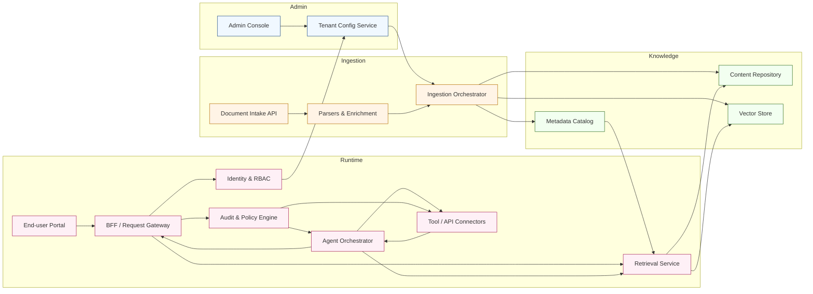

[<< Back to Index](index-ja.html) 

# エージェント型 AI SaaS プラットフォーム

## 概要
RAG（Retrieval-Augmented Generation）とエージェント型 AI フローを核としたマルチテナント SaaS。管理者は直感的な Web コンソールからユーザー／ロール／組織のナレッジベースを一元管理できます。

エンドユーザー（従業員・パートナー・顧客など）は、会話型 AI チャットを備えたポータルにアクセスし、社内固有のナレッジを照会して文脈に応じた回答を得たり、エージェントワークフローを通じて自動化タスクを実行できます。

ナレッジ管理、セキュアなアクセス制御、チャットベースのインタラクションを組み合わせ、意思決定、カスタマーサポート、運用効率を高めます。

## アーキテクチャ

### コンポーネントの役割
- Admin Console／Tenant Config: テナント・ユーザー・ロール・ナレッジ・ガードレールのセルフサービス設定。
- Document Intake API／Parsers: 一括アップロードやコネクタ（SharePoint、CRM、SIS）を受付、正規化、メタデータ抽出、埋め込み生成。
- Ingestion Orchestrator: クローリングのスケジューリング、重複排除、来歴管理、正規化資産をストレージとベクター索引へ投入。
- Content Repository／Metadata Catalog: 版管理・メタデータ・アクセス制御を備えたカノニカル文書を保持し、取得時のフィルタリングに活用。
- Vector Store: テナント分離で埋め込みを保持。メタデータフィルタ付きの類似検索を提供。
- Identity／RBAC: マルチテナント認証、SSO 連携、ユーザー／エージェントのきめ細かな権限制御。
- End-user Portal／BFF・Gateway: チャット UX、ローカライズ、レート制限、セッション方針の適用。
- Retrieval Service: ハイブリッド検索（ベクトル＋キーワード）、メタデータフィルタ、出典付きコンテキスト返却。
- Agent Orchestrator: エージェントワークフロー・ツール選択・ガードレール・応答組み立て。人へのエスカレーションも管理。
- Tool／API Connectors: 企業システム（CRM、SIS、チケティング、カレンダー）へのポリシー順守の実行とスロットリング。
- Audit／Policy Engine: エージェント／ツールの操作監視、順守（PII マスキング、承認フロー）を強制、監査証跡を記録。

## ユースケース
国際的な教育企業は、入学要件、資格同等性、プログラム推薦、出願期限、必要書類に関する問い合わせを毎日数多く受け取ります。質問は多国籍・多言語から寄せられ、正確な案内には各大学のポリシー、各国の資格枠組み、過去の判断履歴などの参照が必要です。

本プラットフォームにより、窓口チームと顧客は、権威ある出典に裏打ちされた迅速で文脈理解に基づく回答を得られます。RAG は機関ハンドブック、各国規制、過去ケースノートから該当箇所を提示。エージェントフローは適格性計算、個別チェックリスト作成、事前入力フォーム生成、アドバイジング予約の提案、曖昧・機微な場合の人へのエスカレーションを調整します。

このユースケースの要点:

- 多言語理解と翻訳により、多言語の問い合わせにも確実に対応
- メタデータ（国・学位レベル・機関）でのコンテキスト検索により、適切な規定を参照
- エージェントによる自動化（適格性判定、書類収集、予約）と、出典付きの説明可能な回答
- きめ細かなアクセス制御と監査証跡で、応募者データを保護しプライバシー規制に準拠
- CRM／SIS／ドキュメントストア／カレンダー連携でエンドツーエンド業務を完結

成果指標の例：初回応答時間、セルフサーブ解決率、retrieval recall@k、幻覚／真実性率、エスカレーション率。例として、スペイン語で海外学位の修士入学要件充足可否を尋ねた場合、国別同等性ガイドラインと大学の入学ポリシーを取得し、適格性を判定、出典付きのバイリンガル要約と不足書類チェックリストを提示し、相談予約候補を提案します。

## ペインポイントと課題

- 分散したコンテンツ: 規程やカタログ、資格文書が PDF/HTML/XML/スプレッドシート/メールなど多様で横断検索が困難
- スケールと発見性: 文書量の多さと頻繁な更新で、人手の検索は非効率でミスも発生
- 古い／不完全なデータ: 変更が頻繁だが、自動で信頼できる更新パイプラインがない
- 運用摩擦: 適格性確認、書類検証、スケジューリングが手作業で繁忙期にボトルネック

## ソリューション

- 自動取り込みパイプライン: 解析器と AI 抽出で PDF/HTML/構造化フィードを正規化し、来歴メタデータ付きで格納
- スマートな索引と検索: チャンク化、メタデータ（国・レベル・機関・有効日）、埋め込みとベクトル検索で高精度な文脈検索
- 継続的なエンリッチメント: AI クローラとスケジュール同期でプロフィールを更新、変更検知で人のレビューへ
- エージェントオーケストレーション: 適格性判定、チェックリスト作成、フォーム事前入力、予約自動化。複雑な案件のみ人へ
- コンプライアンスと監査性: RBAC、暗号化（保存／転送）、監査証跡で入試ガバナンスと保護要件を満たす

## ビジネス価値

- 応答速度とセルフサーブ向上: 初回応答短縮、自己解決率の向上（成熟度によって 40–70% 向上を目標）
- 運用コスト削減: 定型業務自動化によりアドバイザー工数を削減（例: 問い合わせ対応 FTE 20–40% 減）
- コンバージョンと満足度向上: 正確で迅速な回答と個別ガイダンスで完了率と NPS を改善
- エラーとリスク低減: 出典付き回答と変更検知で誤案内を減らし、順守と是正コストを抑制
- 測定可能な KPI: 初回応答、セルフサーブ率、recall@k、幻覚率、エスカレーション率、ケース当たり時間、完了率

導入メモ: 代表的なパイロット（1地域／1機関）から開始し、検索品質とエージェントフローを検証。KPI を測定し、段階的にカバレッジを拡大、CRM/SIS と統合。

[<< Back to Index](index-ja.html)