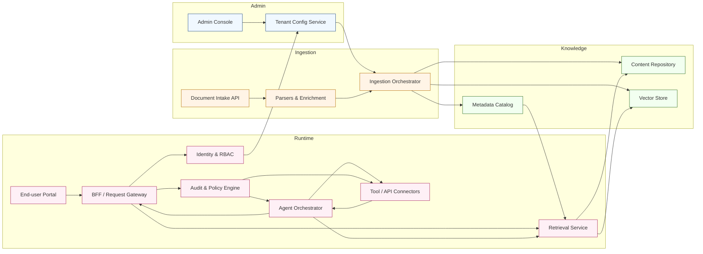

[<< Back to Index](index.html) 

# Agentic AI SaaS Platform

## Introduction
A multi-tenant SaaS platform powered by RAG (Retrieval-Augmented Generation) and agentic AI flows, designed for enterprise use. The platform enables administrators to centrally manage users, roles, and organizational knowledge bases through an intuitive web console.

End users — such as employees, partners, or customers — can seamlessly access a web portal equipped with a conversational AI chat interface. This empowers them to query company-specific knowledge, receive context-aware responses, and execute automated tasks through agentic workflows.

By combining knowledge management, secure access control, and intelligent chat-based interaction, the platform enhances enterprise decision-making, customer support, and operational efficiency.

## Architecture

### Component responsibilities
- Admin Console & Tenant Config: Self-service setup for org admins to manage tenants, users, roles, knowledge bases, and guardrail policies.
- Document Intake API & Parsers: Accept bulk uploads or connectors (SharePoint, CRM, SIS), normalize documents, extract metadata, and generate embeddings.
- Ingestion Orchestrator: Schedules crawls, deduplicates content, tracks provenance, and pushes normalized assets into storage and the vector index.
- Content Repository & Metadata Catalog: Persist canonical documents with versioning, metadata, and access control flags for retrieval filtering.
- Vector Store: Stores embeddings with tenant segmentation, supporting similarity search with metadata filters.
- Identity & RBAC: Multi-tenant auth, SSO integration, and fine-grained permissions controlling user and agent access to content and tools.
- End-user Portal & BFF/Gateway: Delivers chat UX, handles localization, mediates requests, and enforces rate limits and session policies.
- Retrieval Service: Performs hybrid search (vector + keyword), applies metadata filters, and returns source-cited context for prompts.
- Agent Orchestrator: Manages agentic workflows, tool selection, guardrails, and response assembly; handles multi-step plans with fallback to humans.
- Tool / API Connectors: Adapters to enterprise systems (CRM, SIS, ticketing, calendar) with policy-aware execution and throttling.
- Audit & Policy Engine: Monitors agent/tool actions, enforces compliance rules (PII redaction, approval workflow), records immutable audit trails.

## Use Case
An international education company receives thousands of customer queries every day about university entrance requirements, qualification equivalencies, program recommendations, application deadlines, and required documentation. Questions come from prospective students across multiple countries and languages, and often require consulting institution-specific policies, national qualification frameworks, and historical admissions decisions to provide accurate guidance.

Using the platform, student-facing teams and customers can get fast, context-aware answers backed by authoritative sources. RAG (Retrieval-Augmented Generation) surfaces precise passages from institutional handbooks, country regulations, and prior case notes. Agentic flows then orchestrate downstream actions such as computing eligibility, assembling a personalized application checklist, generating pre-filled forms, scheduling an advising session, or initiating escalation to a human counselor when the request is ambiguous or sensitive.

Key capabilities for this use case:

- Multilingual understanding and translation so queries in different languages are handled reliably.
- Context-aware retrieval with metadata filters (country, degree level, institution) to ensure the answers reference the correct rules.
- Agentic orchestration to automate routine tasks (eligibility checks, document collection, calendar booking) and to provide explainable, source-cited responses.
- Fine-grained access control and audit trails to protect applicant data and support compliance with privacy regulations.
- Integrations with CRM, student information systems (SIS), document storage, and calendar services to complete end-to-end workflows.

Measurable outcomes include faster first-response times, higher self-serve resolution rates, fewer escalations to human staff, and improved application conversion. Example KPIs to track: average first-response time, self-serve resolution rate, retrieval recall@k, hallucination/factuality rate, and escalation rate to counselors.

Example scenario: a prospective student asks in Spanish whether their foreign diploma meets admission requirements for a master's program. The system retrieves the relevant country equivalency guidelines and the target university's admissions policy, runs an eligibility check via an agentic flow, returns a bilingual summary with citations, offers a personalized checklist of missing documents, and proposes time slots to book an advising session — only escalating to a human counselor if the case remains unclear.

## Pain Point and Challenges

- Fragmented content: university policies, course catalogs, and national qualification documents exist in many formats (PDF, HTML, XML, spreadsheets, email threads), making unified search and retrieval difficult.
- Scale and discoverability: a high volume of documents and frequent policy updates make manual lookup slow and error-prone for advisors and applicants.
- Stale or incomplete data: institution and course profiles are frequently updated, and the organization lacks an automated, auditable pipeline to keep knowledge current.
- Operational friction: routine eligibility checks, document validation, and scheduling consume significant staff time and create bottlenecks during peak application seasons.

## Solution

- Automated ingestion pipeline: programmatic parsers and AI-assisted document extraction normalize PDFs, HTML pages, and structured feeds into a canonical content store with provenance metadata.
- Smart indexing and retrieval: chunking, metadata tagging (country, level, institution, effective date), embeddings, and vector search ensure high-precision, contextual retrieval.
- Continuous enrichment: an AI-powered crawler and scheduled syncs refresh institution and course profiles, while change detection flags updates for human review.
- Agentic orchestration: modular agent flows perform eligibility checks, assemble personalized checklists, pre-fill forms, and automate calendar booking — escalating to human advisors only for complex or sensitive cases.
- Compliance and auditability: role-based access, encryption-at-rest/in-transit, and immutable audit trails support data protection requirements and admissions governance.

## Business Value

This platform delivers measurable business value across cost, quality, speed, and compliance:

- Faster response and higher self-serve: Reduce average first-response times and increase the percentage of inquiries resolved without human intervention (target improvement: 40–70% self-serve rate uplift depending on maturity).
- Operational cost savings: Automating routine checks and document processing reduces advisor workload and allows teams to scale without linear headcount increases (example ROI: 20–40% reduction in support FTEs for inquiry handling).
- Higher conversion and applicant satisfaction: Quicker, accurate answers and personalized guidance improve application completion rates and NPS among prospective students.
- Reduced error and risk: Source-cited answers and change-detection reduce the risk of incorrect guidance and support regulatory compliance, lowering downstream remediation costs.
- Measurable KPIs: average first-response time, self-serve resolution rate, retrieval recall@k, hallucination/factuality rate, escalation rate, advisor time per case, and conversion rate from inquiry to application.

Implementation notes: begin with a representative pilot (one region/institution) to validate retrieval quality and agent flows, measure KPIs, then expand coverage and integrate with CRM/SIS for end-to-end tracking.

[<< Back to Index](index.html)