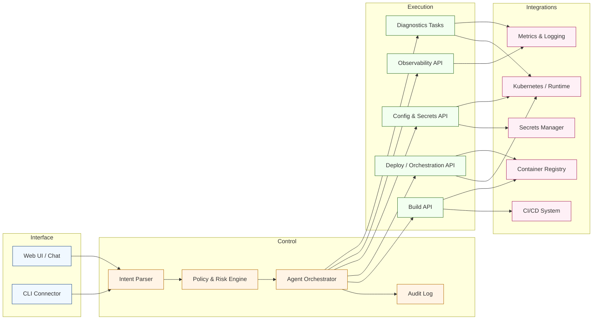

[<< Back to Index](index-ja.html) 

# エージェント型 AI を活用した実験的 DevOps ツール

## 概要
コンテナ化アプリのビルド／デプロイ／テスト／実行時トラブルシュートを支援する、軽量の会話型 Web ツールです。

## アーキテクチャ

### コンポーネントの役割
- Web UI / Chat & CLI Connector: 会話とターミナルの入口。意図の取得、説明表示、確認トークン要求を担います。
- Intent Parser: 自然言語のコマンドを構造化アクションに変換します。
- Policy & Risk Engine: 要求アクションをガードレール（環境スコープ、破壊的操作）に照らして評価し、必要に応じて承認を要求します。
- Agent Orchestrator: マルチステップ計画、ツール呼出順序、リトライ、会話コンテキスト維持を行います。
- Audit Log: すべてのアクションと入出力、承認を記録し、監査と事後検証を可能にします。
- Build API: イメージビルド、アーティファクト昇格、CI とレジストリ連携をトリガーします。
- Deploy / Orchestration API: デプロイスペック（K8s、Helm）を適用／パッチし、ロールアウト／ロールバックを実施します。
- Config & Secrets API: 環境変数、ConfigMap、シークレット参照を安全に更新。スコープとマスキングを強制します。
- Observability API: ログ・メトリクス・トレース・イベントを取得。保存クエリ実行と異常要約を行います。
- Diagnostics Tasks: スモークテスト、ヘルスチェック、スキーマ差分など軽量の検証を実行します。
- Container Registry & CI/CD System: 画像とビルドメタデータの保管と昇格／ロールバック元。
- Kubernetes / Runtime: マルチ環境へのコンテナワークロードのデプロイ・運用対象。
- Metrics & Logging Platform: トラブルシュートに用いる運用テレメトリーのソース。
- Secrets Manager: デプロイと運用に参照される認証情報の中枢。

## ユースケース
小規模チームやスタートアップは、専門 DevOps の不足に直面しがちです。現代のデリバリープラクティス習熟には時間がかかり、過剰なツール群の寄せ集めも負担です。

多くのチームはコンテナ（Docker 等）でサービスを出荷します。典型的なライフサイクル:
1. ソースから Docker イメージをビルド
2. 実行時設定（環境変数、ボリューム、ネットワーク、ポート、シークレット）を定義
3. 可用性とコア機能を検証
4. 近リアルタイムでヘルス、ログ、カスタムメトリクスを監視

## ペインポイントと課題
- エラーが発生しやすい: 画像・設定・シークレット・ネットワークなど多要素の整合が必要
- 遅いトラブルシュート: ビルド・デプロイ・ランタイム層の横断知見不足
- ナレッジの分散: 少人数や断片的ドキュメントに知見が偏在
- コンテキストスイッチ: CLI・ダッシュボード・ログビューア・モニタ間の往復
- 受動的な姿勢: 影響発生後にのみ問題を発見

## ソリューション
エージェント型 AI アシスタントがもう一人の DevOps メイトのように振る舞います。

自然言語の意図（例: 「staging に api サービスをロールアウト」「環境変数 X をパッチ」「不健康なコンテナを再起動」「CPU スパイクの理由は？」「失敗中の Pod ログを表示」）を解釈し、認可されれば定義済みの安全な API を介して以下を実行します:
- コンテナ仕様の作成／更新／パッチ
- イメージビルドと再デプロイのトリガー
- 設定変更の適用（環境変数、シークレット参照、リソース制限）
- ログ・メトリクス・イベントの取得と要約
- 軽量の診断／検証タスクの実行

アシスタントは Human-in-the-loop を維持します。すべての操作は説明可能・監査可能で、リスクに応じて確認を要求。ビルド成果物、実行時シグナル、履歴の相関から原因候補を浮かび上がらせ、次の一手を提案、定型作業を自動化します。

## ビジネス価値
- 反復の高速化: 深いプラットフォーム知識なしで build→deploy→verify を短縮
- 認知負荷の低減: 散在する運用ビューを会話インターフェースに統合
- オンボーディング短縮: 新人は部内知見を探す代わりに質問できる
- 安定したリリース: ミスコンフィグと異常の早期検出
- 運用のスケール: 過度なプロセス負荷なく DevOps 容量を拡張

[<< Back to Index](index-ja.html)
