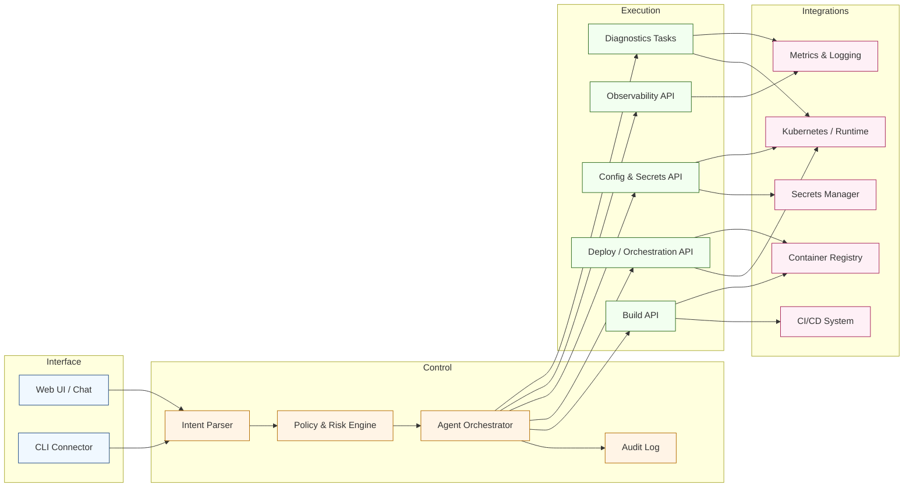

[<< Back to Index](index.html) 

# Agentic AI Empowered Experimental DevOps Tool

## Introduction
A lightweight web-based conversational tool that assists with core DevOps workflows: building, deploying, testing, and runtime troubleshooting of containerized applications.

## Architecture

### Component responsibilities
- Web UI / Chat & CLI Connector: Conversational and terminal entry points that capture intents, display explanations, and request confirmation tokens.
- Intent Parser: Natural-language understanding layer that converts user commands into structured actions with parameters.
- Policy & Risk Engine: Evaluates requested actions against guardrails (environment scope, destructive operations) and escalates for approval when needed.
- Agent Orchestrator: Plans multi-step workflows, sequences tool calls, handles retries, and maintains conversational context with the user.
- Audit Log: Records every action, input, output, and confirmation for compliance and postmortem review.
- Build API: Triggers image builds, artifact promotions, and integrates with CI pipelines and registries.
- Deploy / Orchestration API: Applies or patches deployment specs (Kubernetes manifests, Helm values) and orchestrates rollouts or rollbacks.
- Config & Secrets API: Safely updates environment variables, config maps, and secret references; enforces scoping and masking policies.
- Observability API: Fetches logs, metrics, traces, and events; runs saved queries and summarizes anomalies.
- Diagnostics Tasks: Executes lightweight probes (smoke tests, health checks, schema diffs) to validate state changes.
- Container Registry & CI/CD System: External systems storing images and build metadata for promotion and rollback.
- Kubernetes / Runtime: Target runtime for deploying and managing container workloads across environments.
- Metrics & Logging Platform: Source of operational telemetry used for troubleshooting and proactive alerts.
- Secrets Manager: Central vault for credentials and tokens referenced by deployments and operational tasks.

## Use Case
Small product teams and early-stage startups often lack dedicated, highly skilled DevOps engineers. Mastering modern delivery practices takes time—especially when forced to stitch together an oversized stack of tools.

Today most teams package and ship services in containers (e.g. Docker). A typical lifecycle includes:
1. Build a Docker image from source
2. Define runtime configuration: environment variables, volumes, networks, ports, secrets
3. Validate availability and core functionality
4. Observe health, logs, and custom metrics in (near) real-time

## Pain Point and Challenges
- Error prone: many moving parts (images, config, secrets, networking) must line up correctly
- Slow troubleshooting: limited expertise prolongs triage across build, deploy, and runtime layers
- Knowledge silos: operational know‑how locked in a few people or fragmented docs
- Context switching: jumping between CLI, dashboards, log viewers, and monitors wastes time
- Reactive posture: issues discovered only after user impact instead of early detection

## Solution
An agentic AI assistant operates like an additional DevOps teammate. 

It interprets natural language intents (e.g. “roll out api service to staging”, “patch env var X”, “restart the unhealthy container”, “why is CPU spiking?”, “show failing pod logs”) and, when authorized, executes predefined safe APIs to:
- Create / update / patch container specs
- Trigger image builds and redeploys
- Apply configuration changes (env vars, secrets references, resource limits)
- Fetch and summarize logs, metrics, events
- Run lightweight diagnostic or validation checks

The assistant keeps a human-in-the-loop model: every action is explainable, auditable, and can require confirmation based on risk level. It correlates build artifacts, runtime signals, and historical actions to surface probable causes, suggest next steps, or automate routine toil—reducing friction without replacing existing tooling or ownership.

## Business Value
- Faster iteration: shorten build→deploy→verify loops without deep platform expertise
- Lower cognitive load: unify scattered operational views into a single conversational interface
- Reduced onboarding time: new engineers ask instead of searching tribal docs
- More stable releases: earlier detection of misconfigurations and runtime anomalies
- Scalable operations: augment limited DevOps capacity without heavy process overhead

[<< Back to Index](index.html)
