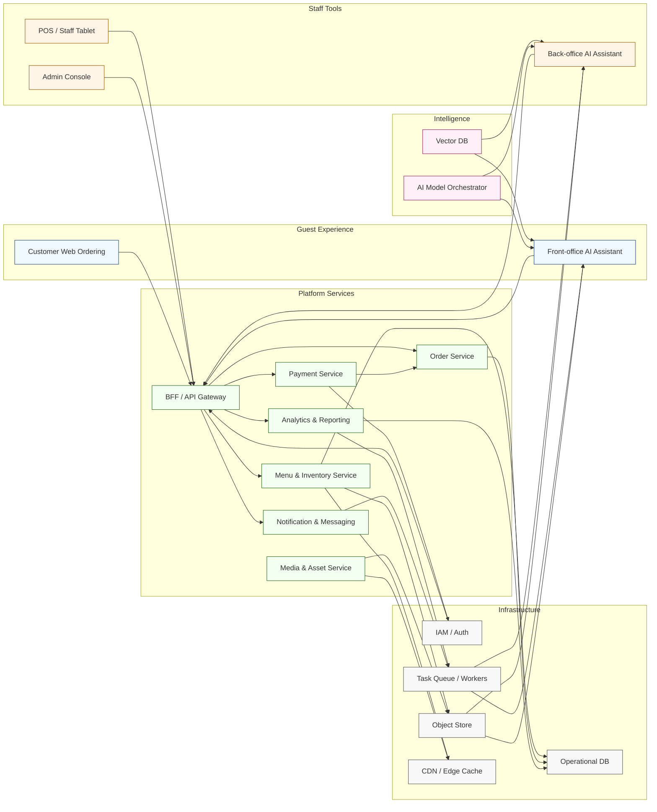

[<< Back to Index](index-ja.html) 

# エージェント型 AI を活用したレストランシステム

## 概要
従来の飲食店オペレーション基盤の上に AI を重ねるプラットフォーム。主な構成:
- 顧客向け Web 注文: コードをスキャンしてメニュー閲覧・カスタマイズ・注文・支払いをスマホで完結
- POS（タブレット）: スタッフ向け高度機能—注文ライフサイクル、テーブル／コース管理、在庫可視化（権限別）
- 管理コンソール: 在庫・メニュー設定、ユーザー／ロール管理、対帳ビュー、顧客体験設定（プロモ、バナー）
- バックオフィス AI アシスタント:
  - 基礎入力から料理画像を生成・補正
  - 多言語の名称／説明を生成、SNS 用プロモ原稿を下書き
  - 主要指標を要約し、定期レポートを自動作成
- フロントオフィス AI アシスタント: 会話で案内（ナビ、料理発見、食事制限フィルタ、ペアリング提案）、チャットから構造化注文

## アーキテクチャ

### コンポーネントの役割
- Customer Web Ordering／Front-office AI: QR ベースの閲覧、会話注文、パーソナライズ、デジタル決済。
- POS／Staff Tablet／Admin Console: 注文ライフサイクル、在庫調整、メニュー設定、対帳を統合。
- Back-office AI: 画像強化、多言語コピー、運用サマリを自動化。承認後にメニュー／マーケへ反映。
- BFF／API Gateway: 認証の一元化、ロケール対応のレスポンス整形、下流サービスのオーケストレーション。
- Menu & Inventory Service: メニュー、在庫、価格を管理し、POS と顧客チャネルへリアルタイム同期。高頻度リードはキャッシュ。
- Order Service: 構造化受注、モディファイア、キッチン／POS へのルーティング、状態遷移を管理。
- Payment Service: 決済ゲートウェイ連携、先払いフロー、レシート、精算エクスポート。
- Media & Asset Service: 料理画像や販促メディアをオブジェクトストアと CDN で配信。
- Analytics & Reporting: 注文・在庫・行動を集約し、KPI と異常検知を提示。
- Notification & Messaging: 予約・確認、プロモ配信、スタッフ通知をメール／SMS／アプリで送信。
- Vector DB & Model Orchestrator: 意味検索、パーソナライズ、会話知能を前後オフィスに提供。
- IAM／Auth: 役割とスコープトークンを扱う安全なマルチテナントアクセスを実現。
- Object Store／Operational DB／CDN: 構造化・非構造化データを低遅延で提供。
- Task Queue／Workers: 画像生成、レポート作成、一括通知などの非同期処理と AI 負荷のスロットリング。

## ユースケース
1. 店内注文
   - ゲストが QR を読み込み、言語適応メニューを閲覧
   - AI が人気・相性の良い品を提案（例: ドリンクのペアリング）
   - アレルゲン／辛さ調整を含むカスタマイズとデジタル決済
   - 構造化モディファイア付きでキッチン／POS にルーティング
2. スタッフオペレーション
   - タブレットでテーブル状況、コース出しタイミング、在庫シグナルを集約
   - マネージャーが品切れ（86）を即時反映
3. メニュー／コンテンツ更新
   - ベース写真と属性をアップロード
   - バックオフィスが多言語説明とプロモ文案を生成
   - 管理者がレビューして公開
4. インサイトとレポート
   - 受注速度、カテゴリ別成績、回転率を集約
   - AI が異常（前菜の急減など）を提示し、シフトサマリを下書き
5. 会話注文のフォールバック
   - 「グルテンフリーは？」に対しフィルタし、カート追加まで対応

## ペインポイントと課題
- 外国人ゲストとの言語摩擦で誤注文や回転低下
- 多言語メニューの手作業・不整合
- コンテンツ作成とレポートの反復作業
- データ活用の不足（在庫予測、メニュー最適化）
- ガイド提案がなくアップセル機会を逃す

## ソリューション
- 統一デジタル注文で翻訳摩擦を削減
- AI ローカリゼーションで名称・説明の多言語化を継続反映
- 会話フロントアシスタントが文脈提案でバスケット増を支援
- バックオフィスが画像強化・多言語コピー・要約レポートを自動化
- リアルタイムのメニュー／在庫可視化で欠品体験を減少し連携改善
- 構造化分析と異常ヒントで先回り調整（メニュー回転、人員配置）

## ビジネス価値
- 注文摩擦の低減により回転率向上
- 適時の提案で平均客単価の向上
- 手作業の多言語化・レポート負荷を削減
- 在庫活用の改善と機会損失の減少
- 言語・食事制限をまたいだ一貫した体験

[<< Back to Index](index.html) 
