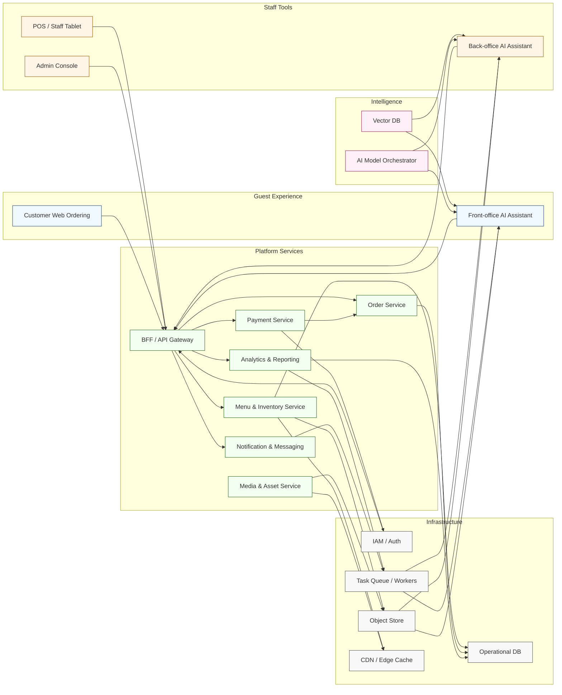

[<< Back to Index](index.html) 

# Agentic AI Empowered Restaurant System

## Introduction
An AI‑augmented platform layered on top of a traditional restaurant operations stack. Core components:
- Customer web ordering: guests scan a code, browse the menu, customize items, place orders, and complete payment on their phones
- POS (tablet): staff (or assisted self‑service) with advanced functions—order lifecycle control, table & course management, inventory visibility for privileged roles
- Admin console: inventory & menu configuration, user / role management, financial reconciliation views, customer experience settings (promotions, banners)
- Back‑office AI assistant:
  - Generates or refines dish images from base inputs
  - Produces multi‑language names & descriptions; drafts promotional copy for social channels
  - Summarizes operational metrics and composes periodic reports
- Front‑office AI assistant: guides customers conversationally (navigation, dish discovery, dietary filtering, pairing suggestions) and can place structured orders via chat

## Architecture

### Component responsibilities
- Customer Web Ordering & Front-office AI Assistant: Provide QR-based browsing, conversational ordering, personalization, and digital payment capture.
- POS / Staff Tablet & Admin Console: Consolidate order lifecycle management, inventory adjustments, menu configuration, and financial reconciliation tasks.
- Back-office AI Assistant: Automates media enhancement, multilingual copywriting, and operational summaries; feeds approved assets into menu and marketing workflows.
- BFF / API Gateway: Centralizes authentication, locale-aware response shaping, and orchestration of downstream services for all clients.
- Menu & Inventory Service: Maintains menu data, availability, and pricing with real-time sync to POS and customer channels; caches high-frequency reads.
- Order Service: Handles structured order intake, modifiers, routing to kitchen printers/POS, and state transitions.
- Payment Service: Integrates with payment gateways, supports advance payment flows, receipts, and settlement exports.
- Media & Asset Service: Stores dish imagery and promotional media, leveraging object storage and CDN distribution.
- Analytics & Reporting: Aggregates orders, inventory signals, and guest behavior to surface KPIs and anomaly alerts.
- Notification & Messaging: Sends confirmations, promotional pushes, and staff alerts via email/SMS/in-app messaging.
- Vector DB & Model Orchestrator: Deliver semantic search, personalization, and conversational intelligence for front- and back-office assistants.
- IAM / Auth: Provides secure multi-tenant access for staff and guests, handling roles and scoped tokens.
- Object Store, Operational DB, CDN: Persist structured/unstructured data and serve content with low latency.
- Task Queue / Workers: Execute asynchronous tasks (image generation, report compilation, bulk notifications) and throttle AI workloads.

## Use Case
1. Customer dine‑in ordering
   - Guest scans QR, browses adaptive (language-aware) menu
   - AI suggests popular or complementary items (e.g., beverage pairing)
   - Customer customizes (allergens, spice level) and pays digitally
   - Order routed to kitchen & POS with structured modifiers
2. Staff operations
   - Staff tablet consolidates active tables, course fire timing, running inventory signals
   - Manager adjusts menu availability (86 items) in real time
3. Menu & content upkeep
   - Staff uploads base dish photo & core attributes
   - Back‑office assistant generates localized descriptions + promotional snippet
   - Admin reviews & publishes
4. Insights & reporting
   - System aggregates order velocity, category performance, table turnover
   - AI surfaces anomalies (e.g., sudden drop in appetizer sales) and drafts shift summary
5. Conversational ordering fallback
   - Guest asks “What’s gluten‑free?”; assistant filters and can add item directly to cart

## Pain Point and Challenges
Small or mid‑sized restaurants commonly face:
- Language friction for foreign guests leads to ordering mistakes and slower turns
- Manual, inconsistent multi‑language menu maintenance
- Repetitive back‑office content & report creation work
- Limited data leverage for proactive decisions (e.g., stock prediction, menu optimization)
- Missed upsell opportunities without guided recommendations

## Solution
- Unified digital ordering replaces paper menus and reduces translation friction
- AI-driven localization keeps dish names & descriptions current across languages
- Conversational front assistant accelerates discovery and increases basket size via contextual suggestions
- Back‑office assistant automates media enhancement, multilingual copy, and summary reports
- Real‑time menu / inventory visibility reduces out‑of‑stock disappointment and improves kitchen coordination
- Structured analytics and anomaly hints enable proactive adjustments (menu rotation, staffing)

## Business Value
- Faster table turns via reduced ordering friction
- Higher average order value from timely AI recommendations
- Lower manual localization & reporting effort
- Improved stock utilization and fewer missed sales due to early signals
- More consistent guest experience across languages and dietary needs

[<< Back to Index](index.html) 
