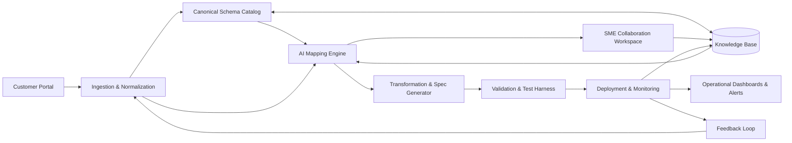

[<< Back to Index](index-ja.html) 

# EDI オンボーディング システム

## 概要
取引先が電子ビジネス文書を接続・交換・検証するプロセスを効率化するオンボーディング基盤。業界標準の EDI（EDIFACT、ANSI X12）とモダン形式（XML、JSON、API）を AI 支援の自動化と組み合わせ、オンボーディングの加速、手作業削減、グローバルサプライチェーンにおける順守を実現します。

中核機能:

- 標準化: カノニカルなビジネススキーマにより、地域や顧客が多様でも一貫した統合を実現
- 自動化: AI によるスキーマ検索、マッピング推薦、MIG 取り込みでオンボーディングを高速化し、エラーを低減
- 柔軟性: EDIFACT の出荷指示から ANSI X12 の請求書まで多様なメッセージ型と形式をサポート
- 可視性: 監視・検証・レポートを内蔵し、リアルタイムにパートナー活動と順守状況を把握
- 継続改善: 人の修正をフィードバックとして取り込み、推薦とマッピング品質を継続的に向上

パートナーのメッセージ形式と社内ビジネスプロセスの橋渡しを行い、正確・安全・スケーラブルなデータ交換を実現。パートナー統合の迅速化、顧客体験の向上、信頼できるオペレーションに寄与します。

## アーキテクチャ

### コンポーネントの役割

- Customer Portal: パートナーのリクエスト、サンプルメッセージ、仕様を収集
- Ingestion & Normalization: アップロードの形式自動判別と正規化
- Canonical Schema Catalog: すべての統合の基盤となる標準スキーマとマッピングの保管
- AI Mapping Engine: 過去の統合と意味的マッチングを活用してマッピングと変換を提案
- SME Collaboration Workspace: 専門家が提案をレビューし、曖昧点を解消。決定は完全なトレーサビリティで記録
- Transformation & Spec Generator: 取引先別の仕様、変換ルール、実装成果物を生成
- Validation & Test Harness: スキーマ／業務ルール検証、リグレッションテストを実行
- Deployment & Monitoring: 本番への昇格、運用監視、SLA 追跡
- Operational Dashboards & Alerts: 指標と例外を可視化
- Knowledge Base: 過去のマッピング、MIG、ルール、フィードバックを集約
- Feedback Loop: 本番学習を取り込み、取り込み・AI モデルを継続最適化

## ユースケース

### 現状（As‑Is）
新規顧客がオンボーディングを依頼すると、提供側は顧客 EDI を社内標準に統合します。主な段階:

顧客リクエストの提出
顧客が EDI ファイルを提出し、オンボーディングを依頼。

既存知識の活用
提供側は既存の説明ファイルを参照し、過去統合の知見を適用してマッピングを加速。

顧客 EDI を社内標準へマッピング
EDI の専門家がファイル説明を解釈し、業界標準と知見を踏まえて社内形式に整合。

課題解決の協働
疑問点や曖昧さがあれば、顧客と協議し、ルールや過去判断を適用して解消。

仕様の作成
確定したマッピングを顧客別仕様として文書化し、今後の保守と実装に備える。

### あるべき姿（To‑Be）
顧客リクエストの提出
顧客はサンプルと仕様をポータルへアップロード。ファイルは自動解析・正規化。

既存知識の活用
過去のマッピング、MIG、決定を索引化。類似事例を提示してブートストラップ。

社内標準へのマッピング
AI がカノニカルスキーマへのマッピングと変換ルールを提案。専門家が差分と出典を見ながら調整・承認。

課題解決の協働
ガイド付き Q&A で往復を削減。決定は再利用可能なルールとして、監査・有効日／版メタデータとともに記録。

仕様の作成
顧客別のマッピング仕様、変換成果物、テストケースを自動生成。

検証と展開
メッセージをスキーマ／業務ルールに対して検証。本番へ昇格し、監視とアラートを適用。

## ペインポイントと課題

- リードタイムが長い: 手作業のマッピングと往復調整で数週間を要する
- 人的工数が大きい: 専門家が反復的なマッピングや文書解析に時間を費やす
- 属人的知識への依存: 知見がチームや過去案件に散在し、一貫性にリスク
- エラーリスクの増大: 手作業変換や曖昧仕様が原因で欠陥やチャージバック、SLA 逸脱

## ソリューション

1) プロバイダーのナレッジベース構築
- 既存の EDI 説明（MIG、PDF、スプレッドシート）や過去マッピングを取り込み
- メタデータ（メッセージ種、版、取引先、有効日）と来歴付きで検索可能な知識基盤へ正規化

2) 顧客の取り込みと正規化
- 顧客はサンプルと仕様を提出。プラットフォームは EDIFACT/X12/XML/JSON を解析し正規化
- メッセージ型、セグメント、修飾子、制約を自動検出し、候補を生成

3) AI 支援のマッピングと変換
- 標準、過去統合、意味的類似からカノニカルスキーマへのマッピングを提案
- 変換ルール（書式、単位変換、コード表）を提案し、ギャップを可視化

4) ガイド付き協働と決定の記録
- 曖昧点の質問テンプレを提供し、決定を再利用可能なルールとして記録。メッセージや版と紐付け

5) 仕様作成・検証・テスト
- 顧客別マッピング仕様と変換成果物を生成
- 事前にスキーマ／業務ルール検証とテストケース自動生成を実施

6) 展開・監視・継続学習
- 本番へ昇格し、スループットやエラー率、SLA を監視
- 例外と修正を知識基盤へ反映し、推薦品質を継続向上

## ビジネス価値

速度・品質・コスト・リスクの観点での効果:

- オンボーディング短縮: 解析・推薦・検証の自動化により数週間→数日に短縮
- 人工数の削減: AI 支援のマッピングとルール再利用で取引先あたり 30–50% 工数削減
- エラーとチャージバックの減少: 本番前検証と出典付き仕様で一次合格率を向上
- スループットと予測性: 標準化プロセスと測定可能な SLA で並行オンボーディングを拡大
- 知識保持: 属人知をルールと決定として制度化し、個人依存を低減
- 順守と監査: 監査証跡、RBAC、スキーマ／版管理で規制・契約義務に対応

推奨 KPI
- オンボーディング サイクル（依頼→本番）
- 取引先／メッセージあたりの SME 工数
- 一次合格率と欠陥密度
- 手戻り率と修正時間
- 本番前のメッセージ検証合格率
- 本番インシデント率と MTTR

ROI の例示
- 現状 4 週間・60 時間/取引先の場合、40% 削減で約 1.6 週間と 24 時間の短縮。年間件数に乗じて効果を算定。

[<< Back to Index](index.html) 
