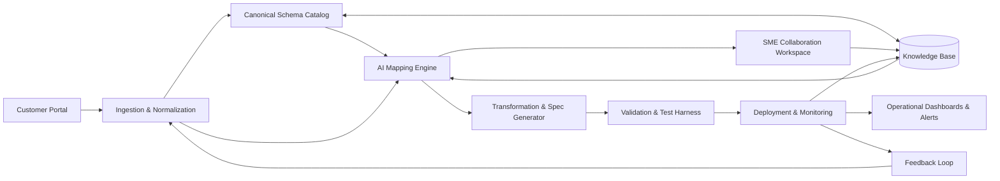

[<< Back to Index](index.html) 

# EDI Onboarding System

## Introduction
The EDI Onboarding Platform streamlines how trading partners connect, exchange, and validate electronic business documents. It combines industry-standard EDI protocols (EDIFACT, ANSI X12) and modern formats (XML, JSON, APIs) with AI-assisted automation to accelerate onboarding, reduce manual effort, and ensure compliance across global supply chains.

Core capabilities:

- Standardization: Canonical business schemas enable consistent integration across diverse customers and regions.
- Automation: AI-assisted schema lookups, mapping recommendations, and MIG ingestion speed up partner onboarding and reduce errors.
- Flexibility: Supports multiple message types and formats, from EDIFACT shipping instructions to ANSI X12 invoices.
- Transparency: Built-in monitoring, validation, and reporting provide real-time visibility into partner activity and message compliance.
- Continuous improvement: Feedback loops capture human corrections to enhance AI recommendations and mappings over time.

By bridging partner message formats and internal business processes, the platform enables accurate, secure, and scalable data exchange—driving faster partner integration, improved customer experience, and reliable supply chain operations.

## Architecture

### Component responsibilities

- **Customer Portal:** Collects partner onboarding requests, sample messages, and specifications.
- **Ingestion & Normalization:** Parses uploaded files, auto-detects formats, and normalizes structures for downstream processing.
- **Canonical Schema Catalog:** Stores standard schemas and mappings that anchor every integration.
- **AI Mapping Engine:** Generates field mappings and transformation suggestions using prior integrations and semantic matching.
- **SME Collaboration Workspace:** Lets experts review AI suggestions, resolve ambiguities, and capture decisions with full traceability.
- **Transformation & Spec Generator:** Produces partner-specific specifications, transformation rules, and implementation artifacts.
- **Validation & Test Harness:** Runs schema and business-rule validation, generating regression test cases prior to go-live.
- **Deployment & Monitoring:** Promotes mappings to production, applies runtime observability, and tracks partner SLAs.
- **Operational Dashboards & Alerts:** Surfaces performance metrics and exceptions for proactive operations.
- **Knowledge Base:** Centralizes historical mappings, MIGs, rules, and feedback to continuously improve automation.
- **Feedback Loop:** Captures production learnings and feeds them into ingestion and AI models for ongoing optimization.

## Use Case

### As‑Is (current process)
When a new customer requests onboarding, the provider must integrate the customer’s EDI files with its own internal EDI standards. The process involves several key stages:

Customer Request Submission
The customer provides an EDI file and requests onboarding.

Leveraging Existing Knowledge
The provider retrieves existing EDI description files and applies tribal knowledge from prior integrations to accelerate mapping.

Mapping Customer EDI to Internal Standards
EDI Subject Matter Experts (SMEs) interpret the customer’s file descriptions, applying industry standards and expertise to align fields with internal EDI formats.

Issue Resolution Collaboration
If questions or ambiguities arise, SMEs collaborate with the customer, applying rules and historical decisions to resolve mapping issues.

Specification Generation
The finalized mapping is documented into a customer-specific EDI mapping specification, ensuring clarity for future maintenance and system implementation.

### To‑Be (with the platform)
Customer Request Submission
Customer uploads sample EDI messages and specs via a portal; files are parsed and normalized automatically.

Leveraging Existing Knowledge
Platform indexes prior mappings, MIGs, and decisions; similar past integrations are surfaced to bootstrap mapping.

Mapping Customer EDI to Internal Standards
AI suggests mappings and transformation rules to canonical schemas; SMEs review, adjust, and approve with side‑by‑side diffs and source citations.

Issue Resolution Collaboration
Guided Q&A reduces back‑and‑forth; decisions are captured as reusable rules with audit trails and effective‑date/version metadata.

Specification Generation
Customer‑specific mapping specification, transformation artifacts, and test cases are generated automatically.

Validation and Rollout
Messages are validated against schemas and business rules; integration is promoted to production with monitoring and alerts.

## Pain Point and Challenges

- Long turnaround time: Onboarding cycles can take weeks due to manual mapping and iterative clarification.
- High human effort: SMEs spend significant time on repetitive mappings and document parsing.
- Dependency on tribal knowledge: Critical know-how is scattered across teams and past projects, risking inconsistency and rework.
- Elevated error risk: Manual transformations and ambiguous specs lead to mapping errors, chargebacks, and SLA breaches.

## Solution

1) Provider knowledge base setup
- Ingest existing EDI description files (MIGs, PDFs, spreadsheets) and past mappings.
- Normalize into a searchable knowledge base with metadata (message type, version, partner, effective dates) and provenance.

2) Customer intake and normalization
- Customer submits sample messages and specs; the platform parses and normalizes structures (EDIFACT/X12/XML/JSON).
- Auto-detect message types, segments, qualifiers, and constraints to seed mapping candidates.

3) AI-assisted mapping and transformation
- Generate mapping suggestions to canonical schemas using standards, prior integrations, and semantic field similarity.
- Propose transformation rules (reformatting, unit conversion, code-list mapping) and highlight gaps for SME review.

4) Guided collaboration and decision capture
- Provide a collaboration workspace with suggested questions for ambiguities.
- Capture decisions as reusable rules; link them to messages and versions for future reuse.

5) Spec generation, validation, and testing
- Produce customer-specific mapping specs and transformation artifacts.
- Auto-generate test cases and validate messages against schemas and business rules before go-live.

6) Deployment, monitoring, and continuous learning
- Promote mappings to production with observability (throughput, error rates, partner SLAs).
- Feed corrections and exceptions back into the knowledge base to improve future recommendations.

## Business Value

Tangible benefits across speed, quality, cost, and risk:

- Reduced time-to-onboard: Cut onboarding cycle time from weeks to days by automating parsing, mapping suggestions, and validation.
- Lower manual effort: 30–50% reduction in SME hours per partner through AI-assisted mapping and reusable rules.
- Fewer errors and chargebacks: Improve first-pass acceptance rate and reduce mapping defects with pre-go-live validation and source-cited specs.
- Higher throughput and predictability: Onboard more partners in parallel with standardized processes and measurable SLAs.
- Knowledge retention: Institutionalize tribal knowledge as reusable rules and decisions, reducing dependency on specific individuals.
- Compliance and auditability: Immutable audit trails, role-based access, and schema/version control support regulatory and contractual obligations.

Suggested KPIs to track
- Onboarding cycle time (request → production)
- SME hours per partner and per message
- First-pass acceptance rate and defect density
- Rework rate and time-to-fix
- Message validation pass rate pre-production
- Production incident rate and mean time to recovery (MTTR)

ROI framing (illustrative)
- If current onboarding averages 4 weeks and 60 SME hours/partner, a 40% reduction yields ~1.6 weeks saved and 24 hours saved per partner; multiplied by annual partner volume to quantify savings.

[<< Back to Index](index.html) 
