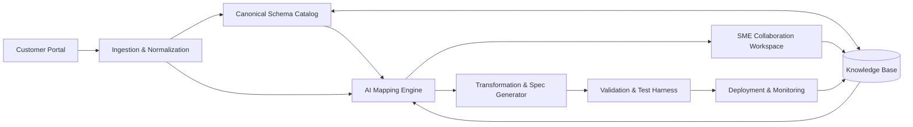

# MapGenie — AI-Driven Logistics & EDI Automation (Maersk)

**Period:** April 2025–June 2026  
**Ownership:** IBM client delivery  
**Client:** A.P. Moller - Maersk  
**Role:** Senior Application Architect / AI Engineer  

## Introduction

MapGenie is an AI-driven automation platform for processing logistics messages, orchestrating EDI transactions, and accelerating partner onboarding across a global supply chain network. It combines standards-aware parsing, a **RAG-backed knowledge base**, **agentic workflows**, and **human-in-the-loop** review to reduce the time and manual effort of partner-specific integrations—including work against the enterprise **Seeburger** integration platform.

After the **February 2026 go-live**, the Lumina / MapGenie workflow reduced mapping change effort from roughly **23 hours to about 30 minutes**, increased throughput by about **46×**, freed about **30,000 specialist hours annually**, and reported **zero AI-generated production incidents** since launch.

## Architecture (logical)

```mermaid
flowchart LR
  A[Customer Portal] --> B[Ingestion & Normalization]
  B --> C[Canonical Schema Catalog]
  C --> D[AI Mapping Engine]
  B --> D
  D --> E[SME Collaboration Workspace]
  D --> F[Transformation & Spec Generator]
  F --> G[Validation & Test Harness]
  G --> H[Deployment & Monitoring]
  C <--> J[(Knowledge Base)]
  E --> J
  H --> J
  J --> D
```

### Highlights

- AI mapping of partner formats toward a canonical model  
- RAG over MIGs / standards / historical mapping decisions  
- Agentic orchestration for validation, disambiguation, and transformation generation  
- Security guardrails (prompt-injection defenses, path validation, workspace isolation)  
- Azure cloud-native delivery: **AKS**, Azure PostgreSQL, Blob, Entra ID, Monitor; **GitHub Actions** CI/CD  

## My contribution

- Architected RAG knowledge base and AI mapping engine (LLM-assisted field mapping)  
- Implemented agentic workflows and SME collaboration (confidence scoring, diff-based approval)  
- Established AI security guardrails and unified delivery workspace design  
- Contributed to Azure platform design (AKS, Blob, PostgreSQL, Entra ID, Monitor) and GitHub Actions delivery  

**Key technologies:** Python, FastAPI, React, TypeScript, PostgreSQL, pgvector, LLM APIs, RAG, agentic workflows, Seeburger, EDIFACT/ANSI X12, AKS, Azure Blob, Azure PostgreSQL, Entra ID, Azure Monitor, GitHub Actions  

## Recognition

MapGenie won three **Danish Digital Award** categories: Best in Digital Business Solutions, Best in Innovative Use of Technology, and Best Use Of Data ([Danish Digital Award site](https://danishdigitalaward.dk/)).
