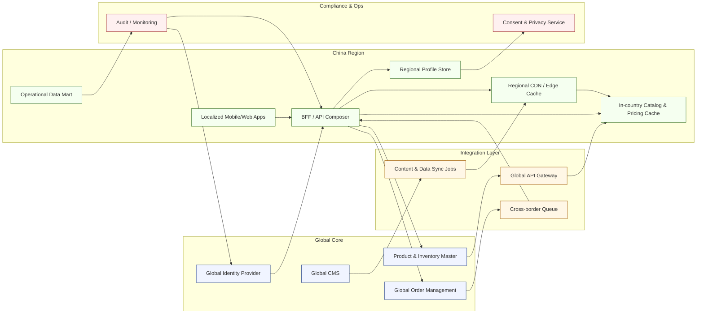

[<< Back to Index](index-ja.html) 

# グローバル EC プラットフォームのローカライゼーションと統合

## 概要
中国で事業を展開するグローバル直販化粧品企業が、既存のグローバル IT を活用しつつ、地域ユーザーの体験を向上させる取り組み。目的は、グローバル資産（ID、商品マスター、受注管理）を再利用しながら、現地の性能・文化適合 UI／UX、順守されたデータ取扱を実現すること。

## アーキテクチャ

### コンポーネントの役割
- Global Identity Provider: 認証の中枢。コンサルタント／顧客のフェデレーションを提供しトークンを発行
- Product & Inventory Master／Order Management: 在庫と受注の SoR を維持し、地域横断で API を提供
- Global CMS: 商品・マーケコンテンツの SoT。地域キャッシュへの同期を駆動
- Global API Gateway／クロスボーダー Queue: 安全な外向き連携経路と冪等な書き込みキューで、変更をグローバルへ反映
- Content & Data Sync Jobs: 定期／イベント駆動のジョブでカタログやアセットを地域に充填し、陳腐化を抑止
- BFF／API Composer: 中国ホストでローカルキャッシュとグローバル API を合成。トークン更新、ローカライズ、スロットリングを管理
- ローカライズされたモバイル／Web: 中国の期待に沿う UI、決済連携、エッジキャッシュを利用
- Regional CDN／Edge Cache: 静的と高頻度ペイロードを地域で提供し、越境遅延を最小化
- 国内カタログ／価格キャッシュ: 低遅延で商品・価格・在庫ビューを提供。書き込みは Queue 経由で SoR へ
- 地域プロファイルストア: 居住要件に適合するため、グローバル ID を参照しつつ中国特有のプロファイル・同意・パーソナライズを保持
- オペレーショナル データマート: 利用状況、受注インサイト、コンサル分析を地域内に集約し、ローカルレポートに活用
- 同意・プライバシーサービス: 同意、データ最小化、規制レポートを地域要件に沿って管理
- 監査・監視: グローバルと地域の可観測性を統合し、SLA と順守の監査証跡を取得

## ユースケース
中国の大規模ユーザーベースで以下の問題が継続:
- ページ／ナビゲーションが遅い
- ローカル期待と異なる UI/UX パターン
- 美容・販売コンサル向け業務ツールが不足（レポート、データ洞察）

## ペインポイントと課題
- 中央ガバナンス: グローバルの SoR（在庫・受注）を維持する必要
- 規制順守: 個人情報は国内保存（データレジデンシー・プライバシー）
- コンテンツ遅延: グローバル CMS からの取得が越境で不安定／低速

## ソリューション
- 国内読み取りミラー: 在庫・カタログ・価格を低遅延で提供し、書き込みは冪等キューでグローバルへ
- ローカライズアプリ: 中国特有の UI パターン、ローカライズ済みコンポーネント、エッジキャッシュで高頻度データを配信
- フェデレーテッド ID（OIDC）: 認証はグローバル IdP、プロファイルと同意は国内保持、トークン最小化を適用
- BFF 層: トークン更新と応答合成、ロケール適用（言語・通貨・フォーマット）
- コンテンツ加速: 商品・マーケ情報をスケジュール＋イベント駆動で地域 CDN/キャッシュへ同期し、遅延時はフォールバック

## ビジネス価値
- 越境ラウンドトリップ削減による高速なページ／API 応答
- ローカライズ UX によるコンバージョンと維持の改善
- グローバル SoR を複製せずに順守（データレジデンシー、プライバシー）を実現
- コンサルの運用摩擦を軽減し、最新データで活動を支援
- 地域キャッシュとフォールバックでコンテンツ障害リスクを低減

[<< Back to Index](index.html) 
