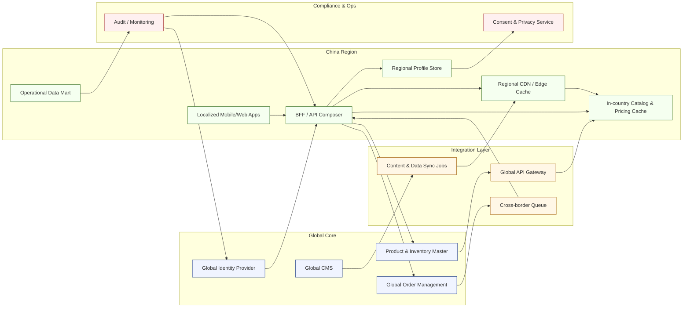

[<< Back to Index](index.html) 

# Localization and Integration for Global E-commerce Platform

## Introduction
A global direct‑selling cosmetics company operates in China and must leverage existing global IT services while improving experience for region‑specific users. The goal: reuse global assets (identity, product master, order management) yet deliver locally performant, culturally aligned interfaces and compliant data handling.

## Architecture

### Component responsibilities
- Global Identity Provider: Centralized authentication authority that issues tokens; supports federated sign-on for consultants/customers.
- Product & Inventory Master / Order Management: Remain the system of record for inventory levels and order lifecycle; expose APIs consumed cross-region.
- Global CMS: Source-of-truth for product and marketing content that drives periodic syncs to the regional cache.
- Global API Gateway & Cross-border Queue: Secure outbound integration path and idempotent write-through queue to route mutations back to global systems.
- Content & Data Sync Jobs: Scheduled/event-driven processes that hydrate regional caches (catalog, assets) and purge stale data.
- BFF / API Composer: China-hosted service composing responses from local caches plus global APIs; manages token refresh, localization, and throttling.
- Localized Mobile/Web Apps: China-friendly front end (localized UX patterns, payment integrations) calling the BFF with short-lived tokens.
- Regional CDN / Edge Cache: Serves static assets and high-frequency payloads locally to minimize cross-border latency.
- In-country Catalog & Pricing Cache: Low-latency read store for product, pricing, and inventory views; syncs back to the system of record via queue.
- Regional Profile Store: Holds China-specific profile, consent, and personalization data to satisfy residency rules while referencing global IDs.
- Operational Data Mart: Aggregates usage, order insights, and consultant analytics within region; powers localized reporting.
- Consent & Privacy Service: Manages opt-ins, data minimization, and regulatory reporting for regional data handling.
- Audit / Monitoring: Unifies observability across global and regional services, capturing SLA metrics and compliance audit trails.

## Use Case
Large and active customer base in China reports persistent issues:
- Slow page load and navigation performance
- UI/UX patterns misaligned with local expectations
- Limited operational tooling for beauty / sales consultants (reporting, data insights)

## Pain Point and Challenges
- Central governance required: global systems (inventory, ordering) must remain single sources of truth
- Regulatory compliance: personally identifiable data must be stored in‑country (data residency & privacy)
- Content latency: product and marketing content from global CMS is unstable / slow when fetched cross‑border

## Solution
- In‑country read mirrors: cache inventory, catalog, and pricing for low‑latency reads while routing authoritative writes to global systems with idempotent queues
- Localized mobile / hybrid app: China‑specific interaction patterns, localized components, and edge caching for high‑frequency data assets
- Federated identity (OIDC): authenticate against global IdP; store region‑specific user profile & consent data domestically, applying token minimization
- BFF (Backend for Frontend) layer: secures and refreshes tokens, composes responses across global + local services, applies locale (language, currency, formatting)
- Content acceleration: scheduled + event‑driven sync of product & marketing content into regional CDN/cache with fallback heuristics when origin latency exceeds threshold

## Business Value
- Faster page & API response times for China users (reduced cross‑border round trips)
- Improved conversion & retention through localized UX patterns
- Compliance alignment (data residency, privacy segmentation) without duplicating core global systems
- Reduced operational friction for consultants with timely reporting & cached product data
- Lower risk of content outages via resilient regional caching & fallback strategy

[<< Back to Index](index.html) 
