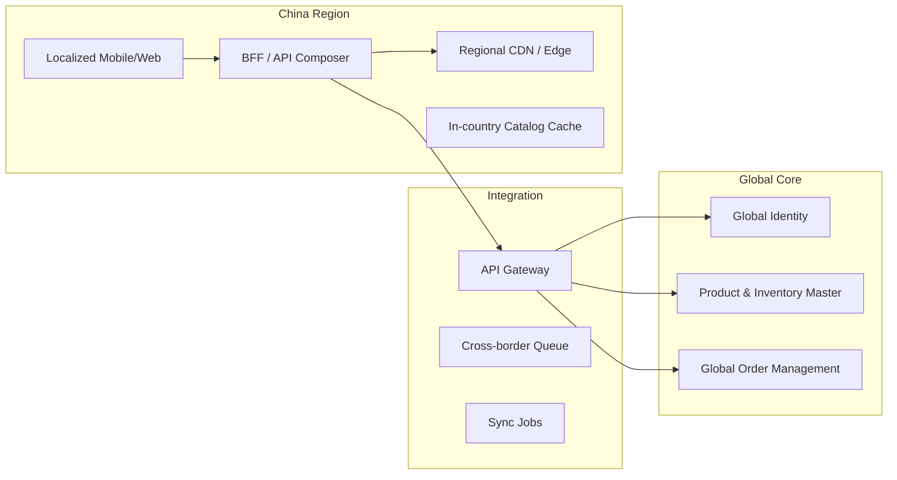

# Global e-commerce

**Period:** April 2017–December 2019  
**Ownership:** IBM client delivery  
**Client:** Oriflame Cosmetics (global direct selling)  
**Role:** Mobile Application Architect  

## Introduction

A global direct-selling cosmetics company operating in China needed to reuse global IT services (identity, product master, order management) while delivering **locally performant**, culturally aligned experiences and **compliant data handling**. The work balanced regional UX and latency with global systems of record.

## Architecture (summary)

```mermaid
flowchart LR
  subgraph Global Core
    GlobalIdP[Global Identity]
    MasterData[Product & Inventory Master]
    OrderSys[Global Order Management]
  end
  subgraph Integration
    APIHub[API Gateway]
    Queue[Cross-border Queue]
    SyncJobs[Sync Jobs]
  end
  subgraph China Region
    BFF[BFF / API Composer]
    Mobile[Localized Mobile/Web]
    EdgeCache[Regional CDN / Edge]
    CatalogCN[In-country Catalog Cache]
  end
  Mobile --> BFF
  BFF --> EdgeCache
  BFF --> APIHub
  APIHub --> GlobalIdP
  APIHub --> MasterData
  APIHub --> OrderSys
```

## My contribution

- Led China-market mobile delivery stream with backend integration and regional constraints  
- Designed localization and performance patterns (BFF, edge caching, in-country catalog/pricing cache)  
- Kept global inventory/order systems as sources of truth while meeting local UX and compliance needs  

**Key technologies:** mobile/web clients, BFF patterns, regional CDN/edge caching, cross-border integration, enterprise identity and order systems
