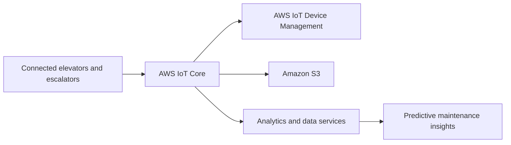

# KONE — Cloud-Native IoT Platform Migration

**Period:** January 2020–December 2021  
**Ownership:** IBM client delivery  
**Client:** KONE Corporation  
**Role:** Cloud Native Application Architect / Full-stack Developer  

## Introduction

KONE’s 24/7 Connected Services platform monitors elevator and escalator telemetry for predictive maintenance and remote monitoring across a global fleet. The program re-platformed from **IBM Watson IoT** to a **cloud-native AWS IoT** foundation to scale connectivity, telemetry volume, and operational analytics.

## Architecture (summary)

### Ops-heavy focus

- Secure device connectivity and high-volume telemetry ingestion  
- Fleet provisioning and device management  
- Large-scale telemetry storage and analytics path  
- **DevOps / CI/CD-based cloud operations** for ongoing platform evolution  
- Migration with minimal disruption to connected services  

## My contribution

- Architected the AWS IoT Core replacement for Watson IoT-scale connectivity  
- Led migration of device connectivity, fleet management, and telemetry pipelines  
- Established DevOps-based cloud operations and CI/CD for the IoT platform  
- Coordinated cross-team transition planning for reliability during cutover  

**Key technologies:** AWS IoT Core, AWS IoT Device Management, Amazon S3, cloud-native architecture, DevOps/CI/CD, microservices, data analytics  

## Grounded outcomes (as recorded)

- Customer-reported elevator/escalator issues reduced by over **40%** (predictive analytics path)  
- Near-**100%** device provisioning success  
- IoT device scalability uplift about **5×** with improved reliability and cost transparency  
- Proactive identification of more than **70%** of equipment faults
