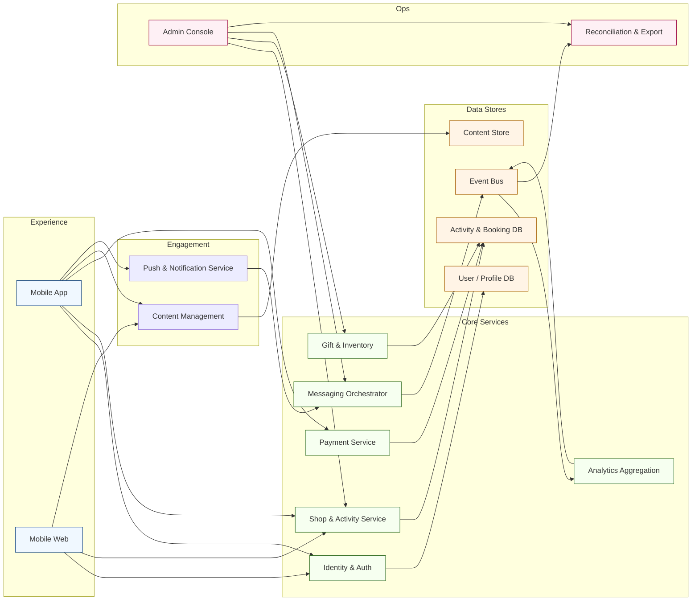

[<< Back to Index](index-ja.html) 

# ペット産業向け多機能コマースプラットフォーム

## 概要
ペット産業に特化したマルチチャネルのコマース指向プラットフォーム。主な構成:
- モバイルアプリ: 編集コンテンツの閲覧、カテゴリ別ショップ発見、レビュー、オフライン活動への参加、ギフト引換、オンライン決済
- モバイル Web: SEO とシェアに適した軽量版。限定機能でショップやコンテンツを発見
- 管理コンソール: 管理者・スタッフ向け
  - ユーザー／ショップ／アクティビティ管理
  - アプリ設定（バナー、ナビゲーション遷移）
  - UGC モデレーション
  - 活動統計とデータエクスポート
  - プッシュ配信の作成と送信
  - ギフト引換の監督
- コンテンツ管理: ユーザー中心の記事（ペット健康、グルーミング、イベント告知、プロモ）を作成・管理・公開
- バックエンド: アイデンティティ／認証、ショップ／アクティビティ連携、決済（オンライン＋精算エクスポート）、コンテンツ配信、通知、分析、ギフト／在庫追跡のモジュラー API 群

## アーキテクチャ

### コンポーネントの役割
- Mobile App／Web: コンテンツ閲覧、ショップ・アクティビティ発見、申込管理、オンライン決済のチャネル
- Content Management: 編集用ツールとワークフロー。健康記事やイベント告知、バナーを発信
- Push & Notification: ターゲット配信、トランザクション通知、ライフサイクル促進
- Identity & Auth: 登録、SSO、トークン発行を扱う中央アカウント。飼い主プロフィールもサポート
- Shop & Activity Service: ショップ掲載、スケジュール、申込、在庫枠のオーケストレーション
- Payment Service: オンライン決済、精算エクスポート、返金、オフライン POS との対帳連携
- Gift & Inventory: ギフトコード、引換状態、イベント時のリアルタイム在庫を追跡
- Analytics Aggregation: 行動・取引シグナルを収集し、ダッシュボードで維持・セグメンテーションに活用
- Messaging Orchestrator: アプリ内メッセージ、SMS/IM、メールをテンプレで配信
- Event Bus: 申込作成や決済完了などのドメインイベントを下流分析と自動化へ連携
- User/Profile DB／Activity/Booking DB: 飼い主、ペット、申込、結果を保持。監査履歴を維持
- Content Store: 記事、メディア、ローカライズ文言を保管
- Admin Console: ユーザー／ショップ／アクティビティ、UGC、設定の運用コンソール
- Reconciliation & Export: 精算レポート、参加サマリ、財務・バックオフィス連携を生成

## ユースケース
同社は年間数百のオフライン活動を実施。代表的なライフサイクル:
1. 事前
   - SNS 等でプロモーション
   - IM やオンラインフォームで参加申込を収集・確認
2. 当日
   - 参加者情報の確認（紙・簡易フォーム）
   - 現地決済（現金、POS）
   - 商品／ギフトの販売・引換
3. 事後
   - 結果の手作業対帳（売上、コスト、フィードバック）

## ペインポイントと課題
- プロモ、申込、チェックイン、精算の手作業が反復
- 現地スループットが紙と決済摩擦で頭打ち
- データが分断され分析が困難
- 参加情報の再利用が弱く、維持やクロスセルに活かせない
- 小規模高頻度イベントで運用コストが高い

## ソリューション
プラットフォームがオフライン活動の全工程をデジタル化し、コマース・コンテンツ・エンゲージメントを統合:
- 事前: ランディング構成、申込取得、オンライン先払い、確認の自動送信
- 当日: モバイルチェックイン・本人確認、決済／引換の一体化、在庫・ギフトのリアルタイム追跡
- 事後: 構造化した結果記録、精算エクスポートの自動化、フィードバック回収
- エンゲージメント層: 知識コンテンツで再訪と信頼を強化、ターゲット配信で維持を加速
- コマース＋発見: レビュー付きのカテゴリ別ショップでクロスサービスを促進
- 管理: モデレーション、設定、エクスポートの一元化で調整コストを削減

## ビジネス価値
- 人員を線形に増やさず収容力を拡大
- 精算の短縮と手作業ミスの減少
- コンテンツ＋プッシュで維持率を向上
- クロスプロモーションで収益を押上げ
- セグメント化・将来のパーソナライズに資するデータ基盤

[<< Back to Index](index.html) 
