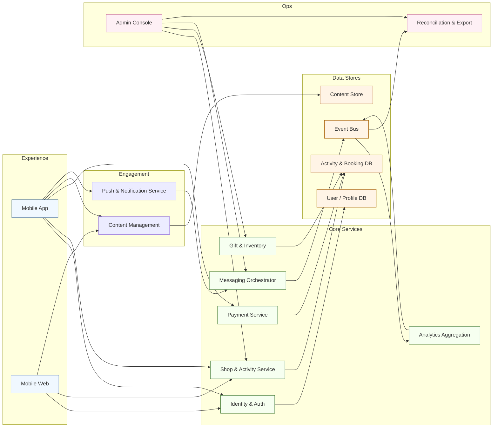

[<< Back to Index](index.html) 

# Multifunctional E-commerce Platform for the Pet Industry

## Introduction
A multi-channel, commerce-oriented platform tailored for the pet industry. Core components:
- Mobile app: browse editorial content, discover categorized shops, view/leave reviews, enroll in offline activities, redeem gifts, complete online payments
- Mobile web app: lightweight version for SEO and social sharing; lets users discover shops and selected content with limited functionality
- Admin web console: for internal administrators and staff to handle
  - User, shop, and activity management
  - App configuration (banners, navigation redirects)
  - UGC moderation
  - User activity statistics & data export
  - Push message composition and delivery
  - Gift code redemption oversight
- Content management system: create, manage, and publish user-centric articles (pet health, grooming, event announcements, activity promotions)
- Backend services: modular APIs for user identity & auth, shop & activity orchestration, payment processing (online + settlement export), content delivery, notification dispatch, analytics aggregation, and gift / inventory tracking

## Architecture

### Component responsibilities
- Mobile App / Web: User-facing channels for browsing content, discovering shops and activities, managing enrollment, and completing online payments.
- Content Management: Editorial tooling and workflows to publish pet health articles, event promos, and in-app banners.
- Push & Notification Service: Manages targeted campaigns, transactional confirmations, and lifecycle nudges across mobile/web.
- Identity & Auth: Central user account service handling registration, SSO, and token issuance with support for pet-owner profiles.
- Shop & Activity Service: Orchestrates shop listings, activity schedules, enrollment flow, and inventory of available slots.
- Payment Service: Handles online payment capture, settlement export, refunds, and integration with offline POS reconciliation.
- Gift & Inventory: Tracks gift codes, redemption states, and real-time inventory during events.
- Analytics Aggregation: Collects behavioral and transactional signals into dashboards for retention and segmentation.
- Messaging Orchestrator: Routes in-app messages, SMS/IM notifications, and confirmation emails with templating support.
- Event Bus: Emits domain events (enrollment created, payment settled) for downstream analytics and automation.
- User/Profile DB & Activity/Booking DB: Persist owners, pets, enrollments, and event outcomes; maintain audit history.
- Content Store: Houses published articles, media assets, and localized copy.
- Admin Console: Operational console for staff to manage users, shops, activities, UGC moderation, and configurations.
- Reconciliation & Export: Generates settlement reports, participation summaries, and feeds to finance/back-office systems.

## Use Case
The company runs hundreds of offline activities each year. A typical lifecycle:
1. Before the activity
   - Promote the event on social / SNS channels
   - Collect and confirm participant enrollment via instant messaging or oneline forms
2. During the activity
   - Verify participant information (paper or basic forms)
   - Collect fees on-site (cash, POS)
   - Sell or redeem goods / gifts
3. After the activity
   - Manually reconcile results: financial balance, costs, participation feedback

## Pain Point and Challenges
- Repetitive manual steps across promotion, enrollment, check-in, settlement
- On-site throughput limits scale (paper-based verification & payment friction)
- Fragmented data makes post-event analysis difficult
- Limited re-use of participation insights for retention or cross-sell
- High operational overhead for frequent, small events

## Solution
The platform digitizes the full offline activity cycle and unifies commerce, content, and engagement in one ecosystem:
- Pre-event: configurable landing content, enrollment capture, advance online payment completion, automated confirmation messaging
- During event: mobile check-in & identity validation, integrated payment / redemption flow, real-time inventory or gift tracking
- Post-event: structured result recording, automated reconciliation exports, feedback & review collection
- Engagement layer: editorial knowledge content drives repeat visits and trust; targeted push messages amplify retention
- Commerce + discovery: categorized shop listings with reviews encourage cross-service adoption
- Administrative control: centralized moderation, configuration, and data export reduce manual coordination

## Business Value
- Higher event capacity without proportional staffing increase
- Shorter reconciliation cycle and fewer manual errors
- Better retention via integrated content + push engagement
- Monetization uplift from cross-promotion of shops and services
- Actionable data foundation for segmentation and future personalization

[<< Back to Index](index.html) 
