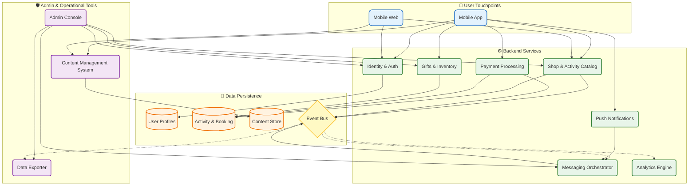

[<< Back to Index](index.html) 

# Pet Services E-commerce Ecosystem

## Introduction
A comprehensive **Online-to-Offline (O2O)** platform designed to digitize the fragmented pet service industry. The ecosystem connects pet owners with service providers (grooming, boarding, training) through a seamless mobile experience while empowering businesses with robust operational tools.

By unifying content, community, and commerce, the platform transforms manual, high-friction offline interactions into streamlined digital workflows, covering the entire lifecycle from discovery and booking to payment and post-service engagement.

## Architecture

```mermaid
flowchart TD
    %% Define styles
    classDef frontend fill:#e3f2fd,stroke:#1565c0,stroke-width:2px,rx:10,ry:10;
    classDef admin fill:#f3e5f5,stroke:#7b1fa2,stroke-width:2px,rx:5,ry:5;
    classDef service fill:#e8f5e9,stroke:#2e7d32,stroke-width:2px,rx:5,ry:5;
    classDef storage fill:#fff3e0,stroke:#ef6c00,stroke-width:2px,shape:cylinder;
    classDef bus fill:#fff9c4,stroke:#fbc02d,stroke-width:2px,shape:rhombus;

    subgraph UserNodes ["👥 User Touchpoints"]
        MobileApp(Mobile App)
        MobileWeb(Mobile Web)
    end

    subgraph AdminNodes ["🛡️ Admin & Operational Tools"]
        AdminConsole(Admin Console)
        CMS(Content Management System)
        Exporter(Data Exporter)
    end

    subgraph ServiceLayer ["⚙️ Backend Services"]
        Auth(Identity & Auth)
        Catalog(Shop & Activity Catalog)
        Payments(Payment Processing)
        Gifts("Gifts & Inventory")
        Push(Push Notifications)
        Messaging("Messaging Orchestrator")
        Analytics("Analytics Engine")
    end

    subgraph DataLayer ["💾 Data Persistence"]
        UserDB[(User Profiles)]
        ActivityDB[("Activity & Booking")]
        ContentStore[(Content Store)]
        EventBus{Event Bus}
    end

    %% User Interactions
    MobileApp --> Auth & Catalog & Payments & Gifts & CMS & Push
    MobileWeb --> Auth & Catalog & CMS

    %% Admin Interactions
    AdminConsole --> Auth & Catalog & Gifts & Messaging & Exporter
    CMS --> ContentStore

    %% Service to Data
    Auth --> UserDB
    Catalog --> ActivityDB
    Payments --> ActivityDB
    Gifts --> ActivityDB

    %% Event Driven Flows
    Catalog & Payments & Messaging --> EventBus
    EventBus -.-> Analytics & Exporter & Messaging

    %% Service Inter-dependencies
    Push --> Messaging

    %% Apply Classes
    class MobileApp,MobileWeb frontend;
    class AdminConsole,CMS,Exporter admin;
    class Auth,Catalog,Payments,Gifts,Push,Messaging,Analytics service;
    class UserDB,ActivityDB,ContentStore storage;
    class EventBus bus;
```

### Component responsibilities
- **Mobile App (iOS/Android):** The primary channel for users to browse editorial content, book services, manage enrollments, and complete secure payments.
- **Mobile Web:** A lightweight, SEO-optimized version focused on discovery, social sharing, and user acquisition.
- **Content Management System (CMS):** Enables editors to create and publish rich media articles on pet health, grooming, and events to drive engagement.
- **Admin Console:** A centralized command center for operations staff to manage users, shops, UGC moderation, and system configurations.
- **Identity & Auth:** Centralized user management handling registration, SSO, and pet profiles.
- **Shop & Activity Engine:** Orchestrates service listings, scheduling, real-time slot inventory, and booking logic.
- **Payment Gateway:** Secure processing for online payments, refunds, and automated settlement reporting for merchants.
- **Push & Notification Service:** Manages lifecycle marketing, transactional alerts, and targeted engagement campaigns.
- **Analytics & BI:** Aggregates operational data to provide actionable insights on retention, conversion, and user behavior.

## Digital Transformation Use Case

### Legacy Process (As-Is)
The company previously managed hundreds of offline events annually via manual workflows:
1.  **Promotion:** Fragmented across social media and SNS channels.
2.  **Enrollment:** Manual collection of participant details via instant messaging or paper forms.
3.  **On-site Operations:** Physical check-in lists, cash-only payments, and manual gift redemption.
4.  **Reconciliation:** Labor-intensive post-event spreadsheet updates for financials and feedback.

### Platform Workflow (To-Be)
The platform digitizes the entire activity lifecycle:
1.  **Pre-Event:** Automated promotion via in-app banners and push notifications; instant online booking and payment.
2.  **During Event:** QR code-based digital check-in; integrated mobile payments for on-site purchases; real-time inventory tracking.
3.  **Post-Event:** Automatic settlement and financial reporting; digital feedback collection; re-engagement campaigns based on participation data.

## Pain Points Noted

- **High Friction:** Repetitive manual data entry across promotion, enrollment, and settlement.
- **Scalability Limits:** Paper-based verification and cash handling created bottlenecks at check-in.
- **Data Silos:** Fragmented participant data made post-event analysis and retention marketing impossible.
- **Operational Overhead:** High staffing requirements for checking participants and reconciling accounts.

## Solution Features

- **End-to-End Digitization:** Unifies discovery, booking, payment, and review into a single app.
- **Content-Driven Commerce:** Editorial content builds trust and naturally drives traffic to service listings.
- **Automated Operations:** Self-service admin tools reduce the need for manual coordination by 60%.
- **Seamless Payments:** Integrated online/offline payment processing simplifies reconciliation.
- **Community Engagement:** Built-in reviews and social features foster a loyal user base.

## Business Value

- **Efficiency:** 3x increase in event capacity without adding headcount.
- **Revenue Growth:** Monetization uplift from cross-selling products and services to event participants.
- **Data utilization:** Actionable insights for segmentation and personalized marketing driven by centralized data.
- **User Retention:** Higher engagement through personalized content and seamless service experiences.

[<< Back to Index](index.html) 
