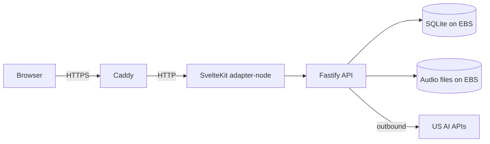

# Tutored (TTD) — Language Learning Product Platform

**Period:** July 2026–Present  
**Ownership:** Founder-led personal product  
**Role:** Founder / full-stack and platform owner  

## Introduction

Tutored is a multi-surface language-learning product (web BFF/UI, Fastify backend API, Flutter mobile) with a production-minded single-instance cloud deploy path. The platform emphasizes secure HTTPS for microphone-based features, durable on-instance state, and a Tokyo-region AWS EC2 footprint for Asian tester latency while calling US-hosted AI speech/LLM services.

**Status:** Under active development (invite-style testing path); deploy topology documented in the product deploy repo.

## Architecture (deploy path)

### Component responsibilities

- **Caddy gateway:** TLS termination (Let's Encrypt in prod), reverse proxy, ports 80/443  
- **SvelteKit webapp:** BFF/UI (Vite, Tailwind)  
- **Fastify backend:** API, SQLite WAL state, audio/TTS cache, practice and chat features  
- **Docker Compose:** `api` + `app` + `gateway` with health-ordered startup  
- **AWS EC2:** Single instance in `ap-northeast-1` (Tokyo); EBS-backed paths for DB and audio (WAL-safe; not NFS/EFS)

## My contribution

- Designed production Compose topology (Fastify, SvelteKit, Caddy) for AWS EC2  
- Configured reverse-proxy TLS and host networking assumptions  
- Specified EBS-backed persistence for SQLite WAL and audio assets  
- Built multi-stage Dockerfiles; owned web stack choices (SvelteKit + Vite + Tailwind)  
- Authored deploy/networking runbooks (Tokyo placement, latency trade-offs, restore paths)  
- **Observability direction:** introducing Prometheus and Grafana alongside structured logs (not claimed as multi-year production fleets)

**Key technologies:** AWS EC2, EBS, VPC/security groups, Docker, Compose, Caddy, Let's Encrypt, Fastify, SvelteKit, Vite, Tailwind, TypeScript, SQLite (WAL), Linux, GitHub Actions; adopting Prometheus & Grafana
