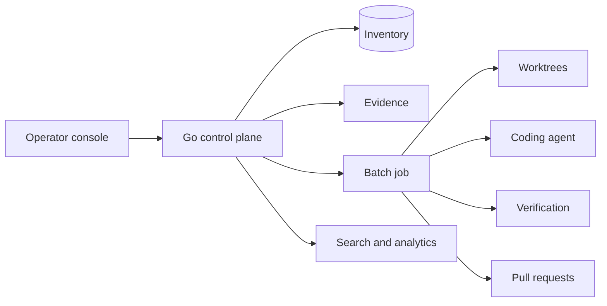

# Defect Drainer — Agent harness for product defects

**Period:** 2026–Present  
**Ownership:** Founder-led · open-source (MIT)  
**Role:** Founder / platform engineer  

Defect Drainer is an agent harness for product bugs. Screenshots and notes become a durable inventory. A coding agent then fixes selected defects in isolated git worktrees, and a defect does not close until evidence and verification both pass. Pull requests are created on the host remote; merge stays on GitHub.

The coding agent is a worker inside the harness, not the product. The runner is pluggable.

## How it works

```
Report → Inventory → Batch fix → Verify → Pull request → Close
```

- **Report** — console, HTTP API, or an agent files a structured defect with evidence.  
- **Inventory** — triage by app, severity, area, and reporter.  
- **Batch fix** — isolated worktrees per repo; the live checkout is not edited. Each app repo has a GitHub or local base and branch.  
- **Verify** — operator-authored commands run twice (baseline, then after the agent). Resolve is blocked on regression or a command that cannot run. Pre-existing failures do not block.  
- **Ship** — create and refresh PRs; resolve only with fix evidence.

## Platform



- **Control plane** — static Go binary (`defect-drainer serve`): inventory, intake, evidence, batches, search. Operator hosts do not need Node at runtime.  
- **Console** — React: onboarding by app, defects, jobs and logs, analytics, per-repo settings.  
- **Search** — OpenSearch over defects, jobs, prompts, and evidence metadata; binaries stay in the evidence store.  
- **Deploy** — Compose: API, console, OpenSearch, Caddy (TLS). Same shape locally and in the cloud.

## My contribution

- Product loop and gates: report → inventory → worktree batch-fix → verify → PR.  
- Go control plane and React operator console.  
- Multi-repo app model (web, mobile, backends as one product).  
- Search, analytics, and verification so a “fixed” defect is something the harness can prove.

**Key technologies:** Go, React, OpenSearch, git worktrees, GitHub CLI, Docker, Caddy
