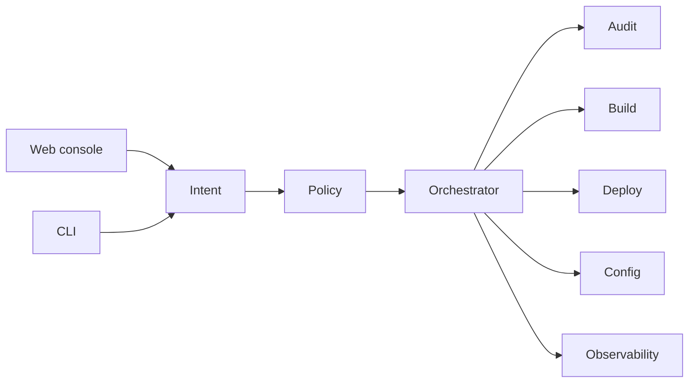

# DeployBot — Agentic DevOps workflows

**Period:** January 2024–Present  
**Ownership:** Founder-led · open-source (MIT)  
**Role:** Founder / platform engineer  

DeployBot is an agentic DevOps platform for teams running containers. Build, deploy, configuration, diagnostics, and troubleshooting run as guided, auditable workflows from a console or CLI—not as a pile of one-off scripts.

## Platform

- Conversational control plane over build, deploy, config, and observe APIs  
- Policy and audit on every run  
- Container registry, CI, Kubernetes/runtime, logs, and secrets as first-class integrations  

## My contribution

- Control plane: intent, policy, orchestration, audit  
- Integrations for registry, CI, Kubernetes, metrics, and secrets  
- Web console and API used by my product teams  

**Key technologies:** Go, TypeScript, SvelteKit, Docker, Kubernetes, CI/CD
