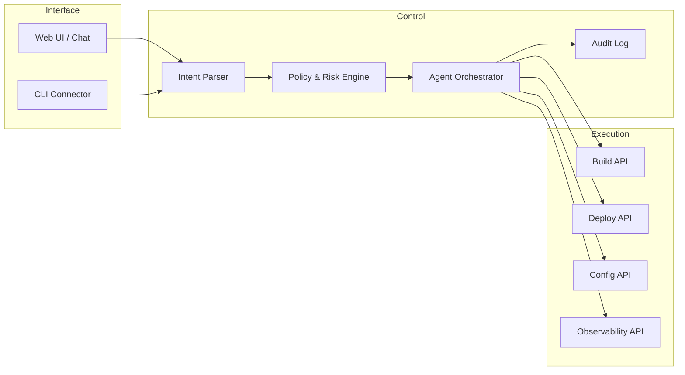

# DeployBot — Open-Source Agentic DevOps Workflow Platform

**Period:** January 2024–Present  
**Ownership:** Founder-led · **open-source (MIT)** tooling used by my product teams  
**Role:** Founder / AI & DevOps tooling engineer  

## Introduction

DeployBot is an open-source, agentic DevOps workflow platform for small product teams running containerized applications. It provides a conversational interface over common delivery and runtime operations—build, deploy, configuration, diagnostics, and troubleshooting—as guided, auditable workflows.

It originated from practical founder-led needs: ship services quickly, keep operational knowledge accessible, and reduce context-switching across CI/CD, registries, runtimes, logs, and secrets.

## Architecture (summary)

## My contribution

- Designed agentic control plane (intent, policy/risk, orchestration, audit) over build/deploy/config/observe APIs  
- Integrated container registry, CI, Kubernetes/runtime, metrics/logging, and secrets patterns for small-team ops  
- Positioned as **open-source ops tooling** for founder platforms—not a full commercial PaaS  

**Key technologies:** **Go** (primary services), **TypeScript** + **SvelteKit** (web console frontend), Docker Engine API, BuildKit, Compose, Kubernetes/Helm-oriented deploy contracts, CI/CD integrations, policy/audit controls, conversational agent orchestration
