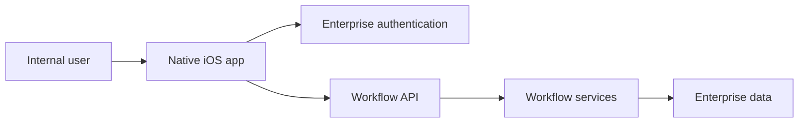

# IBM Internal OA — Pre-sales workflow iOS app

**Period:** January 2015–March 2017  
**Ownership:** IBM internal delivery  
**Role:** Senior iOS Developer  

A native iOS app that moved IBM pre-sales and office-automation workflow off the desktop. Users sign in, review active items, and complete approvals and updates on iPhone, with business rules remaining on the server.

## Platform

- Native iOS (Objective-C, UIKit) for day-to-day workflow  
- Enterprise authentication for internal sessions  
- Backend-driven task state — not duplicated on the device  

## My contribution

- Native Objective-C/UIKit experience for OA and pre-sales workflow  
- Enterprise authentication and workflow API integration  
- Mobile flows that stay consistent with internal systems  

**Key technologies:** iOS, Objective-C, UIKit, REST APIs, enterprise authentication
