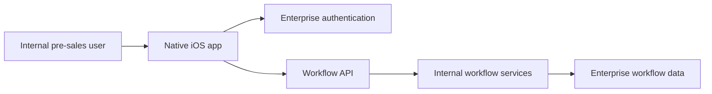

# IBM Internal OA — Pre-sales workflow iOS app

**Period:** January 2015–March 2017  
**Ownership:** IBM internal delivery  
**Client / Product:** IBM internal office automation (OA) / pre-sales workflow  
**Role:** Senior iOS Developer  

## Introduction

An internal native iOS app that moved IBM pre-sales and office-automation workflow off the desktop. Internal users could sign in, review active items, and progress approvals and updates on iPhone while staying aligned with backend-controlled business rules.

This is earlier **native iOS (Swift, UIKit)** enterprise delivery — the same career as current SwiftUI work on Sketch Forge, not a different identity.

## Architecture

### Component responsibilities

- **Native iOS app:** UIKit screens, navigation, and day-to-day workflow interactions  
- **Enterprise authentication:** Secure mobile sessions for internal users  
- **Workflow API / services:** Backend-driven task state, approvals, and transitions — not duplicated on device  

## My contribution

- Built the native Swift/UIKit iOS experience for internal OA and pre-sales workflow  
- Integrated enterprise authentication and backend workflow APIs  
- Delivered responsive mobile flows so approvals and updates stayed consistent with internal systems  

**Key technologies:** iOS, Swift, UIKit, enterprise authentication, REST APIs, backend-driven mobile architecture  

## Value

- Mobile enablement for desktop-bound OA / pre-sales steps  
- Operational responsiveness for internal users away from a desk  
- Architecture alignment: workflow state stayed on the server
