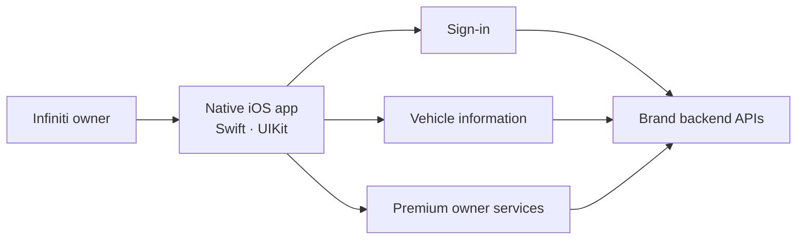

# Gan Ai Bang — Infiniti owner app (China)

**Period:** January 2017–December 2018  
**Ownership:** Independent contract  
**Role:** Contract iOS developer — whole app  

A native iOS app for Infiniti owners in the China market. Owners sign in, see their vehicle, and reach the premium owner services attached to the brand from the phone rather than through dealer channels. Named 敢爱邦 after Infiniti China's 敢·爱 brand line, and shipped on the China App Store.

## Platform

- Native iOS in Swift and UIKit — the full owner-facing surface
- Sign-in, vehicle information, and premium service access against brand backend APIs
- Built and released for the China App Store across a two-year product lifecycle

## Design decision — Swift over Objective-C

The codebase was new, with no Objective-C to interoperate with. Swift's optionals removed a class of nil-related crash that Objective-C's silent nil-messaging hides, and the smaller surface kept the app maintainable as it grew across two years of releases.

## My contribution

- Built the whole application, from first build through App Store release and subsequent iterations
- Owned the owner-facing feature surface and its integration with brand backend services
- Chose and carried the Swift codebase decision across the product lifecycle
- Owned the China App Store release path

**Key technologies:** iOS, Swift, UIKit, REST APIs, China App Store distribution
