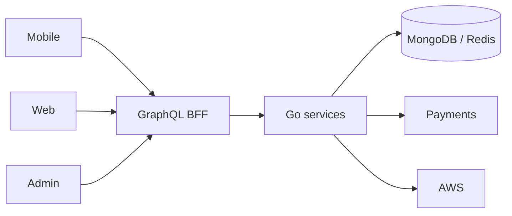

# Mohiguide — Pet Services O2O Platform

**Period:** February 2022–Present  
**Ownership:** Founder-led product  
**Role:** Founder / full-stack product engineer  

Mohiguide is an online-to-offline platform for pet services: content, shops, events, vouchers, commerce, and community. Pet owners and operators share one product across mobile, web, and admin, on a Go services backend.

## Platform

- **Mobile** — iOS and Android: content, booking, enrollment, payments  
- **Web** — SvelteKit customer channel  
- **Admin** — React operations console (orders, inventory, support)  
- **Backend** — Go microservices (users, pets, events, vouchers, orders, messaging) behind a GraphQL gateway  
- **Cloud** — containerized services on AWS (load balancing, CloudFront, S3, IAM), CI/CD on GitHub Actions  

## My contribution

- End-to-end product: mobile, web, admin, and Go APIs  
- GraphQL gateway so all surfaces share one contract  
- AWS delivery, Compose-based service stack, GitHub Actions  
- Payments, messaging, object storage, and content/commerce connectors  

**Key technologies:** Mobile, SvelteKit, React, TypeScript, GraphQL, Go, MongoDB, Redis, Docker, AWS, GitHub Actions, Stripe  

## Outcomes

- About **3×** event capacity without adding headcount  
- Cross-sell into event participants  
- Clearer service boundaries and a repeatable release path
