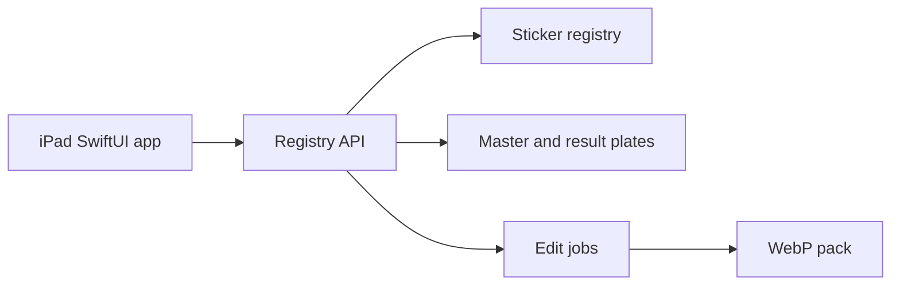

# Sketch Forge — Native iOS sticker studio

**Period:** July 2026–Present  
**Ownership:** Founder-led  
**Role:** Founder / native iOS engineer  

Sketch Forge is an iPad-first native iOS app (Swift, SwiftUI) for sticker QA and publish: import, review, additive edit, approve, then ship a WebP pack. The UI is Apple-native—not a web view. It talks to a registry API over REST.

## What it does

- **Library** — grid, status and tag filters, search, multi-select approve or flag  
- **Review** — master vs checker / light / dark plates, defect tags, comments  
- **Compare** — candidate vs revision, enqueue edit jobs, set the official candidate  
- **Publish** — approved plates become a market pack for downstream apps  

## My contribution

- Swift / SwiftUI iPad client: library, review, compare  
- Registry client and models for stickers, versions, tags, comments, and jobs  
- Explicit candidate/approved pointers so review never invents a revision  

**Key technologies:** Swift, SwiftUI, iOS / iPadOS, REST APIs
