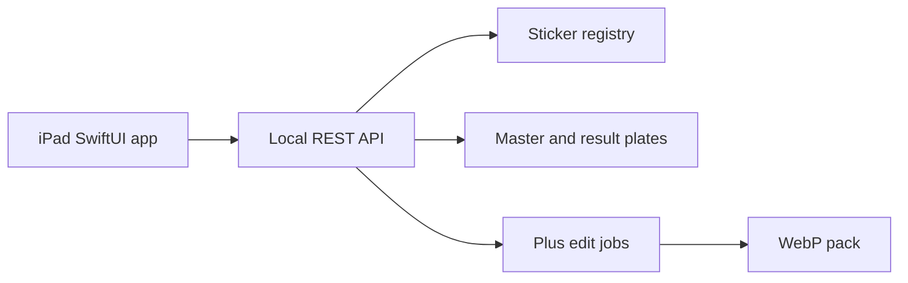

# Sketch Forge — Native iOS sticker QA (Swift / SwiftUI)

**Period:** July 2026–Present  
**Ownership:** Founder-led creator tooling (Tutored sticker pipeline)  
**Role:** Founder / native iOS engineer  

## Introduction

Sketch Forge is the iPad-first operator surface for Tutored sticker masters: import → review → additive edit → approve → publish a WebP pack. The shippable client is a **native iOS app in Swift and SwiftUI** (iOS 17+, iPad-first), not a Flutter or web wrapper. It talks to a local Node registry over REST.

The stack choice is deliberate: SwiftUI owns navigation, library grids, review, compare, and job status so the creator loop stays on Apple-native UI.

## What the iOS app does

- **Library:** SwiftUI grid with status chips, tag groups, fuzzy search, multi-select approve/flag  
- **Review:** master vs checker / light / dark plates, defect tags, comments, prev/next  
- **Compare / Plus:** candidate vs revision panes, enqueue async edit jobs, poll status, set candidate  
- **Client:** `URLSession` + `async/await` + `ObservableObject` against the local API  

The UI is a Swift package (`SketchForge`) hosted by an Xcode app target.

## Architecture

## My contribution

- Designed and built the native Swift / SwiftUI iPad client (library, review, compare)  
- Implemented the Swift registry client and JSON models for stickers, versions, tags, comments, and jobs  
- Kept official candidate/approved pointers explicit so QA previews do not invent a revision  

**Key technologies:** Swift, SwiftUI, iOS 17 / iPadOS, NavigationStack, ObservableObject, async/await, URLSession, REST APIs, Node backend  

**Honesty:** This is current founder-led product work. Earlier IBM internal OA iOS was UIKit/Swift. Sketch Forge is the modern SwiftUI proof.
