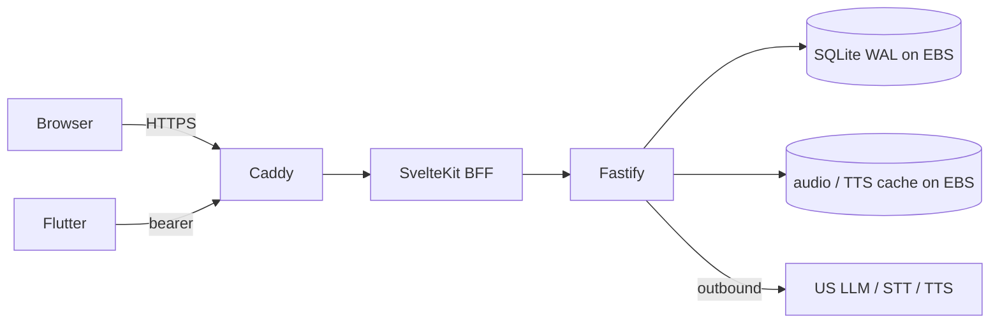

# Tutored — language-learning product in production

**Period:** July 2026–Present  
**Ownership:** Founder-led  
**Role:** Founder / platform owner  

Invite-style language tutor: bring material (chat or photo), approve a drill, practice, then review. Runtime lives in `tutored`. Course authoring and publish live in `tutored-ops`.

**Now:** closed/invite testing on a single Tokyo host. Web is the product path; iOS/Android talk the same API. Billing, Postgres, and quota are deferred.

## Runtime (`tutored`)

One Compose stack locally and in prod: Caddy (TLS) → SvelteKit BFF → Fastify API. Flutter uses bearer tokens against the API, not the BFF.



- **API** owns auth, SQLite, agent, speech, course catalog.  
- **BFF** is same-origin cookie proxy — no DB or model calls of its own.  
- **Host:** one EC2 in `ap-northeast-1`. State on **EBS** (SQLite WAL is unsafe on EFS/NFS).  
- **TLS:** Let's Encrypt in prod; internal CA locally. Mic features need HTTPS.  
- **Region:** testers in Asia/NZ; models are US-hosted. Inference dwarfs the Pacific hop, so the box stays near users and fat STT uploads ride the AWS backbone.

## Content ops (`tutored-ops`)

Authoring is a separate pipeline, not a CMS inside the learner app.

```text
ops packs/  →  validate / publish  →  runtime content/courses + static/courses  →  enroll / study
```

- Pack = one enrollable SKU (`pack.json` + assets). Live example: **NZ School English Y5–8**.  
- Studio: React console + Fastify authoring API. Schema/CLI in TypeScript + Zod.  
- Learner store is file-backed after publish; do not hand-edit runtime course files.

## Cost and safety (what is live)

- High-frequency read-aloud grading is a **local text diff**, not an LLM call. TTS is cached on disk.  
- Agent tools are allowlisted and owner-scoped; learner notes are treated as data, not instructions.  
- Login is live (web cookie, mobile bearer). Self-serve signup, invite-gate, rate limits, and off-site backup are planned, not the current floor.  
- Observability: structured logs today; Prometheus/Grafana adopting, not a production fleet.

## My contribution

- Split an all-in-one app into Fastify API + thin BFF + Flutter client on one contract.  
- Production deploy path: multi-stage images, Compose, Caddy, EBS volumes, Tokyo/network runbooks.  
- Content factory: pack model, validate/publish into the runtime, catalog sync.  
- Speech and agent path designed so spend and data scope stay bounded.

**Key technologies:** TypeScript, Fastify, SvelteKit, Flutter, SQLite (WAL), Docker Compose, Caddy, AWS EC2/EBS
