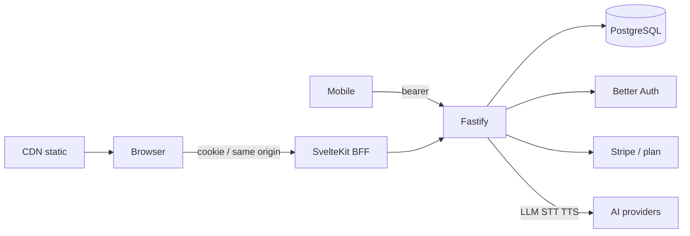

# Tutored — multi-surface language-learning SaaS

**Period:** July 2026–Present  
**Ownership:** Founder-led  
**Role:** Founder / platform owner  

A language tutor that turns chat, a photographed page, or past mistakes into an approved practice set, then remembers what the learner got wrong. Web and mobile share one API. Course authoring is a separate publish pipeline from the learner product.

## Platform

SvelteKit is a same-origin BFF for the **web** (httpOnly cookies, streamed LLM). Fastify is the system of record — auth, plans, quota, speech, and data. **Mobile talks to Fastify directly** with bearer tokens — it does not go through the BFF. Hashed web assets sit on a CDN; SSR stays in-region next to the API.



- **Identity:** Better Auth — email register / verify / reset and Google, one model for web cookie and mobile bearer.  
- **Plans:** Stripe drives `request.plan`; Fastify hooks enforce Free vs Pro and usage quota (LLM / STT / TTS).  
- **Data:** PostgreSQL (Drizzle) for multi-tenant accounts, usage, and learning records.  
- **Ops:** request-correlated logs, product events, metrics; automated backup and restore; CI/CD to a containerized regional stack.

## Content ops

Curriculum is a publish pipeline, not an in-app CMS.

```text
author packs  →  validate  →  publish  →  catalog / enroll / study
```

A pack is one enrollable SKU (`pack.json` + assets). Studio: React console, Fastify authoring API, Zod schema and CLI. Example series: **NZ School English**.

## Product design

- The tutor **proposes**; the learner **approves** — no silent tool side-effects.  
- Read-aloud grading is a local text diff; TTS is cached. Model spend stays on generation and explanation.  
- Agent tools are allowlisted and owner-scoped. Learner notes are data, not instructions.

## My contribution

- SaaS topology: Fastify API, thin SvelteKit BFF for web, mobile on the same API (not via BFF).  
- Auth, plan, and quota as middleware — not per-handler special cases.  
- Content factory: pack model, validate/publish, catalog sync.  
- Speech and agent path designed so cost and data scope stay bounded.

**Key technologies:** TypeScript, Fastify, SvelteKit, Mobile, PostgreSQL, Better Auth, Stripe, Docker, Caddy, AWS, CDN
