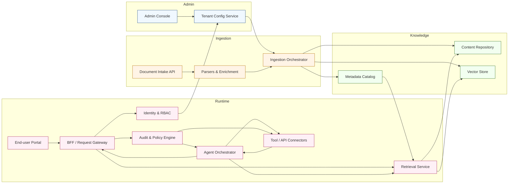

[<< Back to Index](../index.html) 

# Generative AI Marketing SaaS Platform

## Introduction
A secure, multi-tenant SaaS platform empowering enterprises to automate marketing workflows and generate on-brand content. Powered by RAG (Retrieval-Augmented Generation) and agentic AI, the platform enables marketing teams to produce high-quality text and image assets anchored in their organization’s specific brand voice and guidelines.

Administrators have granular control over users, roles, and knowledge bases through a centralized web console. Meanwhile, creative teams access a conversational workspace to brainstorm, draft, and refine campaigns, leveraging agentic workflows to publish directly to social media channels like Facebook, Instagram, and corporate blogs (WordPress).

By combining brand-aware knowledge management with automated distribution, the platform accelerates content velocity while ensuring consistency and compliance across all customer touchpoints.

## Architecture

### Component responsibilities
- Admin Console & Tenant Config: Self-service setup for org admins to manage tenants, users, roles, knowledge bases, and guardrail policies.
- Document Intake API & Parsers: Accept bulk uploads or connectors (SharePoint, CRM, SIS), normalize documents, extract metadata, and generate embeddings.
- Ingestion Orchestrator: Schedules crawls, deduplicates content, tracks provenance, and pushes normalized assets into storage and the vector index.
- Content Repository & Metadata Catalog: Persist canonical documents with versioning, metadata, and access control flags for retrieval filtering.
- Vector Store: Stores embeddings with tenant segmentation, supporting similarity search with metadata filters.
- Identity & RBAC: Multi-tenant auth, SSO integration, and fine-grained permissions controlling user and agent access to content and tools.
- End-user Portal & BFF/Gateway: Delivers chat UX, handles localization, mediates requests, and enforces rate limits and session policies.
- Retrieval Service: Performs hybrid search (vector + keyword), applies metadata filters, and returns source-cited context for prompts.
- Agent Orchestrator: Manages agentic workflows, tool selection, guardrails, and response assembly; handles multi-step plans with fallback to humans.
- Tool / API Connectors: Adapters to enterprise systems (CRM, SIS, ticketing, calendar) with policy-aware execution and throttling.
- Audit & Policy Engine: Monitors agent/tool actions, enforces compliance rules (PII redaction, approval workflow), records immutable audit trails.

## Use Case
A global retail brand manages dozens of regional marketing teams, each requiring frequent social media updates, blog posts, and campaign visual assets. The challenge is maintaining a consistent brand voice, adhering to visual identity guidelines, and orchestrating approvals across distributed teams and time zones.

Using the platform, marketing associates can query the brand knowledge base for approved messaging, generate draft posts with matching imagery, and schedule them for publication. RAG ensures that every piece of generated content references the latest campaign playbooks and tone-of-voice guidelines. Agentic flows handle the end-to-end process: from drafting and image generation to approval routing and API-based publishing.

Key capabilities for this use case:

- **Brand-Aware Generation:** LLMs finetuned or prompted with brand guidelines to produce text that sounds authentic.
- **Image Generation:** AI models generating visual assets that adhere to color palettes and style guides.
- **Multi-Channel Publishing:** Automated scheduling and posting to Facebook, Instagram, and WordPress via integrated APIs.
- **Approval Workflows:** Agentic orchestration that routes drafts to managers for review before going live.
- **Asset Management:** Centralized repository for approved copy and visuals, accessible via semantic search.

Measurable outcomes include increased content throughput, reduced time-to-market for campaigns, and stricter adherence to brand guidelines. Example KPIs to track: content production velocity, approval cycle time, engagement rates per channel, and brand consistency scores.

## Pain Point and Challenges

- **Inconsistent Brand Voice:** with decentralized teams, maintaining a unified tone and visual identity across regions is difficult.
- **Slow Content Production:** manual drafting, design iterations, and approval chains create bottlenecks, delaying campaign launches.
- **Fragmented Tools:** marketers switch between copy docs, design tools, file servers, and scheduling platforms, leading to inefficiency.
- **Compliance Risks:** unapproved assets or off-brand messaging can damage reputation; lack of audit trails makes accountability hard.

## Solution

- **Centralized Knowledge Base:** ingest brand guidelines, past successful campaigns, and approved assets into a RAG-enabled store.
- **Generative AI Studio:** an interactive workspace where users generate text and images that are "born on-brand" using retrieval-augmented prompts.
- **Unified Workflow Engine:** agentic flows that connect generation, review, and publishing into a single seamless process.
- **Role-Based Governance:** strict permissions ensure only authorized personnel can approve or publish content to live channels.
- **Automated Distribution:** direct integrations with social platforms and CMS remove the manual friction of posting.

## Business Value

This platform drives marketing efficiency and brand equity:

- **Accelerated Time-to-Market:** Launch campaigns in hours instead of weeks by automating drafting and asset creation.
- **Brand Consistency:** Ensure 100% of output aligns with global standards through RAG-enforced guidelines.
- **Cost Efficiency:** Reduce reliance on external agencies for routine content creation and localization.
- **Scalability:** Empower small local teams to produce enterprise-quality output without adding headcount.
- **Data-Driven Insights:** Track which generated assets perform best to continuously refine the content strategy.

Implementation notes: Start with a pilot for a specific campaign or region to tune the brand voice models and approval workflows before rolling out globally.

[<< Back to Index](../index.html)