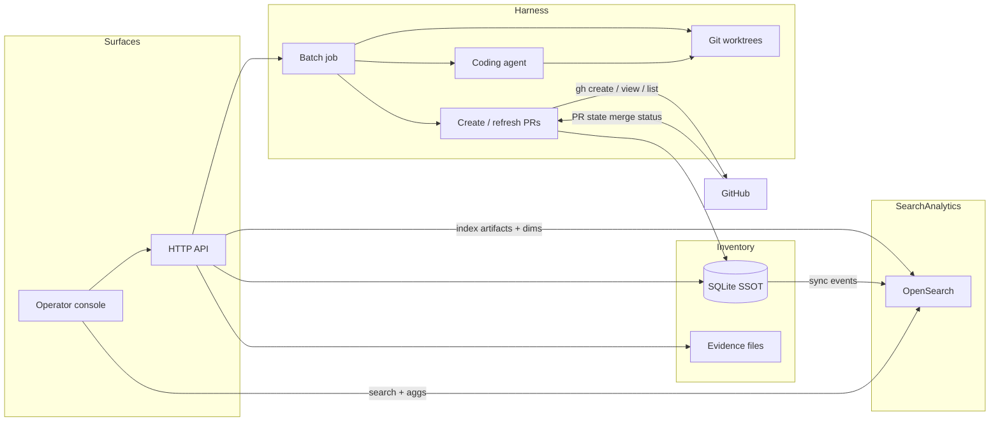

# Defect Drainer — Agent harness for product defect fixing

**Period:** 2026–Present  
**Ownership:** Founder-led · **open-source**  
**Role:** Founder / full-stack platform engineer  

## Business problem

Product bugs pile up as screenshots and chat notes while day-to-day work lives in other trackers. Unstructured backlog is hard to triage, unsafe to hand to an AI coding agent on a live checkout, and easy to “resolve” without proof.

Defect Drainer treats defects as a **durable inventory SSOT**, then runs **bounded batch-fix jobs** so coding agents edit only isolated worktrees, attach **fix evidence**, and ship through host **git / PR** actions—not free-form ticket chat.

Operators also need **find and analytics** across heterogeneous artifacts (defects, jobs, prompts, screenshots, logs, future video)—not only CRUD lists.

## Function (one loop)

```
Report → Inventory → Harness (batch job) → Prove → Ship → Close
```

| Stage | Outcome |
|---|---|
| **Report** | Screenshot + notes → structured defect + report evidence (console, HTTP API, or agent) |
| **Inventory** | SQLite SSOT; triage/select by app and severity; no code changes yet |
| **Batch fix** | Coding-agent job on `git worktree`s; branches under `defect-drainer/<BATCH-…>` |
| **Prove** | **fix_evidence** required before resolve |
| **Ship** | Create PR / refresh merge status via host `gh` (merge stays on GitHub) |
| **Close** | Resolve only when fix is evidence-backed |

Product language is **runner-agnostic** (“AI coding agent”, “batch fix job”); the harness owns inventory, gates, and deterministic git/PR ops. The agent is a **worker inside the harness**, not the product.

## Architecture overview



| Component | Role |
|---|---|
| **defect-drainer-backend** | Fastify harness API: apps, intake, defects, evidence, batch agent jobs, worktree setup, job logs, Create/Refresh PR |
| **defect-drainer-console** | React + MUI operator UI: report, defects, jobs, evidence; target search + analytics views |
| **SQLite** | SSOT for apps, defects, batches (`backend/.data/defect-drainer.db`) |
| **evidence/** | Screenshot/binaries on disk; paths in SQLite (blobs never stored in the search engine) |
| **OpenSearch** | Derived **search & light analytics** index over multi-type artifacts (Elasticsearch-compatible API class); see umbrella plan |
| **Apps registry** | Per product surface; multi-repo URLs; operators select **app** (seeded: Tutored web + mobile) |

**Harness concerns:** workspace isolation (worktrees; primary checkouts not edited), sandbox profiles, BRIEF/handoff payloads, job observability, stop/re-run, fail-closed if worktree setup fails.

**Surfaces (same inventory):** console (day-to-day), HTTP API (scripts / future SDKs), coding agent (may write defects in-schema).

### Search & analytics (planned platform capability)

Heterogeneous artifacts (jobs, images, prompts, evidence notes, logs, future video) are not one normalized table. Plan:

1. **SSOT** keeps structured facts (`defect` dims, `prompt_use` events, job outcomes, blob paths).  
2. **OpenSearch** indexes a uniform envelope per artifact (type, app/defect/job ids, `body_text`, labels, time, `blob_uri`) for unified find + aggregations.  
3. **Analytics:** defect kinds (area/severity/app/source), prompt usage for troubleshooting, harness health—via SQL first, then OpenSearch aggs.  
4. **Optional later:** Loki for raw job-log firehose; warehouse only if history/volume demands it.

OpenSearch is the chosen Elasticsearch-class engine (AWS-friendly, Apache 2.0). Full rationale: Defect Drainer `docs/search-and-analytics.md`.

**Also planned:** TypeScript / Dart client SDKs; shared chat via sibling **chat-canvas** (MCP into the harness—does not replace it).

## My contribution

- Framed and built the **agent harness** workflow (report → inventory → batch fix → prove → PR → resolve)  
- Fastify backend: SQLite inventory, multi-repo clone/worktree isolation, batch jobs, fix-evidence gates, host PR lifecycle  
- React operator console for report, triage, jobs, and evidence review  
- App-centric multi-repo model so one product surface can span web/mobile/backends  
- Designed multi-artifact **search & analytics** architecture targeting **OpenSearch** (inventory SSOT + blob store + derived index; prompt_use and defect-dimension events for analytics)

**Key technologies:** TypeScript, Fastify, React, MUI, SQLite, OpenSearch (search/analytics index), git worktrees, GitHub CLI (`gh`), Docker-friendly local operator loop  
