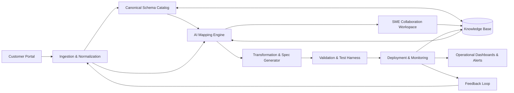

[<< Back to Index](../index.html) 

# AI-Driven Logistics & EDI Automation

## Introduction
A comprehensive automation platform designed to revolutionize the onboarding and management of logistics trading partners. By synergizing industry-standard EDI protocols (EDIFACT, ANSI X12) with cutting-edge AI technologies—including **Large Language Models (LLMs)**, **Retrieval-Augmented Generation (RAG)**, and **Agentic Workflows**—the platform drastically reduces the time and complexity of integrating global supply chain ecosystem.

Key capabilities include:
- **Intelligent Schema Mapping:** AI-driven alignment of disparate partner data formats (xml, json, csv, etc) to a canonical internal data model.
- **RAG-Powered Compliance:** Instant retrieval of complex message implementation guidelines (MIGs) and partner-specific validation rules.
- **Agentic Orchestration:** Autonomous agents that validate data, resolve schema ambiguities, and generate executable transformation code.
- **Real-time Observability:** End-to-end tracking of message lifecycles with proactive error detection and self-healing recommendations.

## Architecture

### Component responsibilities

- **Customer Portal:** Self-service interface for partners to upload specifications and sample files, initiating the automated onboarding flow.
- **Ingestion & Normalization:** Universal parser that detects file types (EDIFACT, X12, XML, JSON) and converts them into a standardized intermediate format.
- **Canonical Schema Catalog:** The central repository of internal data models that serves as the "source of truth" for all integrations.
- **AI Mapping Engine:** Uses LLMs to semantically analyze partner fields and suggest high-confidence mappings to the canonical schema.
- **SME Collaboration Workspace:** A "human-in-the-loop" interface where experts review AI confidence scores and approve or refine complex mappings.
- **Transformation & Spec Generator:** Automatically compiles approved mappings into executable code (e.g., XSLT, Python) and documentation.
- **Validation & Test Harness:** Simulates production traffic to verify data integrity and compliance with business rules before deployment.
- **Deployment & Monitoring:** Manages the rollout of new integrations and provides granular tracking of message throughput and SLAs.
- **Operational Dashboards & Alerts:** Visualizes system health and triggers alerts for anomalies, leveraging AI for root cause analysis.
- **Knowledge Base (RAG):** Context engine that retrieves relevant standards and historical decisions to guide the AI Mapping Engine.
- **Feedback Loop:** Reinforcement learning mechanism that improves mapping accuracy based on SME overrides and production data.

## Use Case

### As‑Is (current process)
When a new customer requests onboarding, the provider must integrate the customer’s EDI files with its own internal EDI standards. The process involves several key stages:

Customer Request Submission
The customer provides an EDI file and requests onboarding.

Leveraging Existing Knowledge
The provider retrieves existing EDI description files and applies tribal knowledge from prior integrations to accelerate mapping.

Mapping Customer EDI to Internal Standards
EDI Subject Matter Experts (SMEs) interpret the customer’s file descriptions, applying industry standards and expertise to align fields with internal EDI formats.

Issue Resolution Collaboration
If questions or ambiguities arise, SMEs collaborate with the customer, applying rules and historical decisions to resolve mapping issues.

Specification Generation
The finalized mapping is documented into a customer-specific EDI mapping specification, ensuring clarity for future maintenance and system implementation.

### To‑Be (with the platform)
Customer Request Submission
Customer uploads sample EDI messages and specs via a portal; files are parsed and normalized automatically.

Leveraging Existing Knowledge
Platform indexes prior mappings, MIGs, and decisions; similar past integrations are surfaced to bootstrap mapping.

Mapping Customer EDI to Internal Standards
AI suggests mappings and transformation rules to canonical schemas; SMEs review, adjust, and approve with side‑by‑side diffs and source citations.

Issue Resolution Collaboration
Guided Q&A reduces back‑and‑forth; decisions are captured as reusable rules with audit trails and effective‑date/version metadata.

Specification Generation
Customer‑specific mapping specification, transformation artifacts, and test cases are generated automatically.

Validation and Rollout
Messages are validated against schemas and business rules; integration is promoted to production with monitoring and alerts.

## Pain Point and Challenges

- Long turnaround time: Onboarding cycles can take weeks due to manual mapping and iterative clarification.
- High human effort: SMEs spend significant time on repetitive mappings and document parsing.
- Dependency on tribal knowledge: Critical know-how is scattered across teams and past projects, risking inconsistency and rework.
- Elevated error risk: Manual transformations and ambiguous specs lead to mapping errors, chargebacks, and SLA breaches.

## Solution

1) **Knowledge Base Construction**
- Ingest legacy MIGs, PDFs, and spreadsheets into a vector database.
- Create a searchable index of historical mappings and partner-specific quirks using RAG.

2) **Intelligent Intake & Analysis**
- Automated parsing of incoming partner specifications to identify message types (e.g., ORDERS, DESADV).
- Logical segmentation of data structures to prepare for semantic analysis.

3) **AI-Assisted Mapping & Transformation**
- LLM-driven proposal of field-level mappings to the Canonical Schema.
- Automatic generation of data transformation logic (e.g., unit conversions, date formatting).

4) **Guided SME Review**
- Interactive "diff" view highlighting low-confidence mappings for expert attention.
- Capture of rationale behind manual overrides to fine-tune the model.

5) **Automated Validation & Testing**
- Generation of synthetic test data based on partner specifications.
- Pre-flight checks against strict business rules to prevent production errors.

6) **Continuous Optimization**
- Deployment of validated integrations with built-in telemetry.
- Automated feedback loop that updates the Knowledge Base with new patterns and edge cases.

## Business Value

- **Radical Reduction in Onboarding Time:** Compresses integration timelines from weeks to days by automating up to 80% of the mapping process.
- **Operational Scalability:** Enables teams to handle concurrent onboarding requests without linear headcount growth.
- **Enhanced Data Quality:** Reduces human error and "chargebacks" through rigorous, automated validation gates.
- **Knowledge Institutionalization:** Transforms tribal knowledge into a systematic, queryable asset, reducing key-person dependency.
- **Agility & Compliance:** Rapid adaptation to new EDI standards and regulatory requirements through centralized schema management.

**Key Metrics:**
- **Onboarding Cycle Time:** Reduced by ~70%.
- **Cost Per Partner Integration:** Lowered by ~50%.
- **First-Pass Yield:** Improved to >90% for standard message types.

[<< Back to Index](../index.html) 
