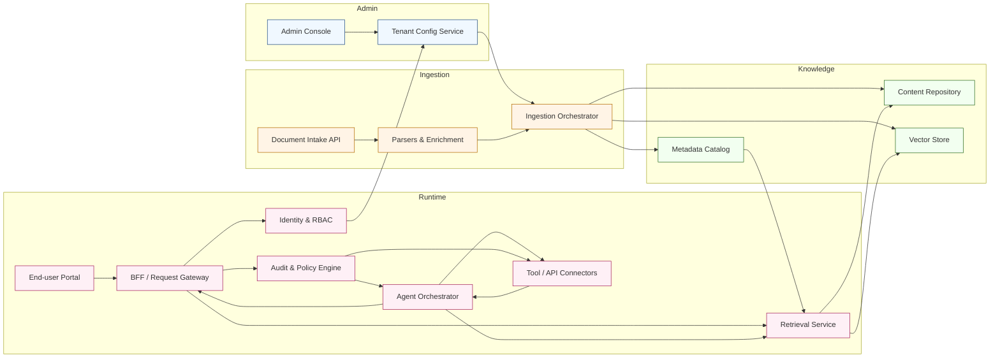

_Last updated: {{UPDATED_AT}}_

[<< Back to Index](../index.html) 

# 生成AIマーケティングSaaSプラットフォーム

## 概要
企業のマーケティングワークフローを自動化し、ブランドに沿ったコンテンツを生成するセキュアなマルチテナントSaaSプラットフォーム。RAG（検索拡張生成）とエージェント型AIにより、マーケティングチームは組織固有のブランドボイスとガイドラインに基づいた高品質なテキストおよび画像アセットを作成できます。

管理者は、一元化されたWebコンソールを通じて、ユーザー、ロール、ナレッジベースを細かく管理できます。一方、クリエイティブチームは、会話型ワークスペースにアクセスしてブレインストーミング、下書き作成、キャンペーンのブラッシュアップを行い、エージェントワークフローを活用してFacebook、Instagram、企業ブログ（WordPress）などのソーシャルメディアチャネルに直接公開できます。

ブランドを意識したナレッジ管理と自動配信を組み合わせることで、顧客とのあらゆるタッチポイントにおける一貫性とコンプライアンスを確保しながら、コンテンツの制作速度を加速させます。

## アーキテクチャ

### コンポーネントの役割
- Admin Console／Tenant Config: テナント・ユーザー・ロール・ナレッジ・ガードレールのセルフサービス設定。
- Document Intake API／Parsers: 一括アップロードやコネクタ（SharePoint、CRM、SIS）を受付、正規化、メタデータ抽出、埋め込み生成。
- Ingestion Orchestrator: クローリングのスケジューリング、重複排除、来歴管理、正規化資産をストレージとベクター索引へ投入。
- Content Repository／Metadata Catalog: 版管理・メタデータ・アクセス制御を備えたカノニカル文書を保持し、取得時のフィルタリングに活用。
- Vector Store: テナント分離で埋め込みを保持。メタデータフィルタ付きの類似検索を提供。
- Identity／RBAC: マルチテナント認証、SSO 連携、ユーザー／エージェントのきめ細かな権限制御。
- End-user Portal／BFF・Gateway: チャット UX、ローカライズ、レート制限、セッション方針の適用。
- Retrieval Service: ハイブリッド検索（ベクトル＋キーワード）、メタデータフィルタ、出典付きコンテキスト返却。
- Agent Orchestrator: エージェントワークフロー・ツール選択・ガードレール・応答組み立て。人へのエスカレーションも管理。
- Tool／API Connectors: 企業システム（CRM、SIS、チケティング、カレンダー）へのポリシー順守の実行とスロットリング。
- Audit／Policy Engine: エージェント／ツールの操作監視、順守（PII マスキング、承認フロー）を強制、監査証跡を記録。

## ユースケース
世界的な小売ブランドが、多数の地域マーケティングチームを管理しており、ソーシャルメディアの更新、ブログ記事、キャンペーン用ビジュアル資産を頻繁に必要としています。課題は、一貫したブランドボイスの維持、ビジュアルアイデンティティガイドラインの遵守、そして分散したチームやタイムゾーンをまたぐ承認プロセスの調整です。

プラットフォームを使用することで、マーケティング担当者はブランドナレッジベースから承認済みのメッセージを検索し、適切な画像を伴う投稿案を生成し、公開スケジュールを設定できます。RAGにより、生成されるすべてのコンテンツが最新のキャンペーン戦略やトーン＆マナーガイドラインを参照することが保証されます。エージェントフローは、下書き作成や画像生成から承認ルーティング、APIベースの公開まで、エンドツーエンドのプロセスを処理します。

このユースケースの主な機能:

- **ブランドを意識した生成:** ブランドガイドラインでファインチューニングまたはプロンプト調整されたLLMを使用し、正真正銘のブランドらしいテキストを作成。
- **画像生成:** カラーパレットやスタイルガイドに準拠したビジュアルアセットを生成するAIモデル。
- **マルチチャネル公開:** 統合APIを通じたFacebook、Instagram、WordPressへの自動スケジュール投稿。
- **承認ワークフロー:** 公開前にマネージャーへ下書きを回覧するエージェントオーケストレーション。
- **アセット管理:** 承認済みのコピーやビジュアルを一元管理し、セマンティック検索でアクセス可能にするリポジトリ。

成果指標の例：初回応答時間、セルフサーブ解決率、retrieval recall@k、幻覚／真実性率、エスカレーション率。例として、スペイン語で海外学位の修士入学要件充足可否を尋ねた場合、国別同等性ガイドラインと大学の入学ポリシーを取得し、適格性を判定、出典付きのバイリンガル要約と不足書類チェックリストを提示し、相談予約候補を提案します。

## ペインポイントと課題

- 分散したコンテンツ: 規程やカタログ、資格文書が PDF/HTML/XML/スプレッドシート/メールなど多様で横断検索が困難
- スケールと発見性: 文書量の多さと頻繁な更新で、人手の検索は非効率でミスも発生
- 古い／不完全なデータ: 変更が頻繁だが、自動で信頼できる更新パイプラインがない
- 運用摩擦: 適格性確認、書類検証、スケジューリングが手作業で繁忙期にボトルネック

## ソリューション

- 自動取り込みパイプライン: 解析器と AI 抽出で PDF/HTML/構造化フィードを正規化し、来歴メタデータ付きで格納
- スマートな索引と検索: チャンク化、メタデータ（国・レベル・機関・有効日）、埋め込みとベクトル検索で高精度な文脈検索
- 継続的なエンリッチメント: AI クローラとスケジュール同期でプロフィールを更新、変更検知で人のレビューへ
- エージェントオーケストレーション: 適格性判定、チェックリスト作成、フォーム事前入力、予約自動化。複雑な案件のみ人へ
- コンプライアンスと監査性: RBAC、暗号化（保存／転送）、監査証跡で入試ガバナンスと保護要件を満たす

## ビジネス価値

- 応答速度とセルフサーブ向上: 初回応答短縮、自己解決率の向上（成熟度によって 40–70% 向上を目標）
- 運用コスト削減: 定型業務自動化によりアドバイザー工数を削減（例: 問い合わせ対応 FTE 20–40% 減）
- コンバージョンと満足度向上: 正確で迅速な回答と個別ガイダンスで完了率と NPS を改善
- エラーとリスク低減: 出典付き回答と変更検知で誤案内を減らし、順守と是正コストを抑制
- 測定可能な KPI: 初回応答、セルフサーブ率、recall@k、幻覚率、エスカレーション率、ケース当たり時間、完了率

導入メモ: 代表的なパイロット（1地域／1機関）から開始し、検索品質とエージェントフローを検証。KPI を測定し、段階的にカバレッジを拡大、CRM/SIS と統合。

[<< Back to Index](../index.html)

_Last updated: {{UPDATED_AT}}_