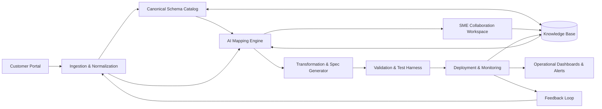

_Last updated: {{UPDATED_AT}}_

[<< Back to Index](../index.html) 

# AI駆動型物流 & EDI自動化

## 概要
物流取引パートナーのオンボーディングと管理を変革するために設計された包括的な自動化プラットフォーム。業界標準のEDIプロトコル（EDIFACT、ANSI X12）と、**大規模言語モデル（LLM）**、**RAG（検索拡張生成）**、**エージェントワークフロー**などの最先端AI技術を融合させることで、グローバルサプライチェーンエコシステムの統合にかかる時間と複雑さを大幅に削減します。

主な機能：

- **インテリジェントスキーママッピング:** 異なるパートナーデータ形式（xml, json, csvなど）をカノニカルな内部データモデルへAI主導で整合。
- **RAGを活用したコンプライアンス:** 複雑なメッセージ実装ガイドライン（MIG）やパートナー固有の検証ルールの即時取得。
- **エージェントオーケストレーション:** データの検証、スキーマの曖昧さの解決、実行可能な変換コードの生成を行う自律型エージェント。
- **リアルタイムの可観測性:** メッセージライフサイクルのエンドツーエンド追跡、プロアクティブなエラー検知、自己修復の推奨。

## アーキテクチャ

### コンポーネントの役割

- **Customer Portal:** パートナーが仕様やサンプルファイルをアップロードし、自動オンボーディングフローを開始するためのセルフサービスインターフェース。
- **Ingestion & Normalization:** ファイルタイプ（EDIFACT、X12、XML、JSON）を検出し、標準化された中間形式に変換するユニバーサルパーサー。
- **Canonical Schema Catalog:** すべての統合の「信頼できる唯一の情報源（Source of Truth）」として機能する内部データモデルの中央リポジトリ。
- **AI Mapping Engine:** LLMを使用してパートナーフィールドを意味的に分析し、カノニカルスキーマへの高信頼度なマッピングを提案します。
- **SME Collaboration Workspace:** 専門家がAIの信頼スコアを確認し、複雑なマッピングを承認または修正する「Human-in-the-loop」インターフェース。
- **Transformation & Spec Generator:** 承認されたマッピングを実行可能なコード（例：XSLT、Python）とドキュメントに自動コンパイルします。
- **Validation & Test Harness:** 本番環境への展開前に、データ整合性とビジネスルールへの準拠を確認するために本番トラフィックをシミュレーションします。
- **Deployment & Monitoring:** 新規統合のロールアウトを管理し、メッセージスループットとSLAを詳細に追跡します。
- **Operational Dashboards & Alerts:** システムの健全性を可視化し、AIを活用した根本原因分析で異常時にアラートを発します。
- **Knowledge Base (RAG):** 関連する標準や過去の決定事項を検索し、AIマッピングエンジンのガイドとなるコンテキストエンジン。
- **Feedback Loop:** SMEの上書き修正や本番データに基づいてマッピング精度を向上させる強化学習メカニズム。

## ユースケース

### 現状（As‑Is）
新規顧客がオンボーディングを依頼すると、提供側は顧客 EDI を社内標準に統合します。主な段階:

顧客リクエストの提出
顧客が EDI ファイルを提出し、オンボーディングを依頼。

既存知識の活用
提供側は既存の説明ファイルを参照し、過去統合の知見を適用してマッピングを加速。

顧客 EDI を社内標準へマッピング
EDI の専門家がファイル説明を解釈し、業界標準と知見を踏まえて社内形式に整合。

課題解決の協働
疑問点や曖昧さがあれば、顧客と協議し、ルールや過去判断を適用して解消。

仕様の作成
確定したマッピングを顧客別仕様として文書化し、今後の保守と実装に備える。

### あるべき姿（To‑Be）
顧客リクエストの提出
顧客はサンプルと仕様をポータルへアップロード。ファイルは自動解析・正規化。

既存知識の活用
過去のマッピング、MIG、決定を索引化。類似事例を提示してブートストラップ。

社内標準へのマッピング
AI がカノニカルスキーマへのマッピングと変換ルールを提案。専門家が差分と出典を見ながら調整・承認。

課題解決の協働
ガイド付き Q&A で往復を削減。決定は再利用可能なルールとして、監査・有効日／版メタデータとともに記録。

仕様の作成
顧客別のマッピング仕様、変換成果物、テストケースを自動生成。

検証と展開
メッセージをスキーマ／業務ルールに対して検証。本番へ昇格し、監視とアラートを適用。

## ペインポイントと課題

- リードタイムが長い: 手作業のマッピングと往復調整で数週間を要する
- 人的工数が大きい: 専門家が反復的なマッピングや文書解析に時間を費やす
- 属人的知識への依存: 知見がチームや過去案件に散在し、一貫性にリスク
- エラーリスクの増大: 手作業変換や曖昧仕様が原因で欠陥やチャージバック、SLA 逸脱

## ソリューション

1) プロバイダーのナレッジベース構築
- 既存の EDI 説明（MIG、PDF、スプレッドシート）や過去マッピングを取り込み
- メタデータ（メッセージ種、版、取引先、有効日）と来歴付きで検索可能な知識基盤へ正規化

2) 顧客の取り込みと正規化
- 顧客はサンプルと仕様を提出。プラットフォームは EDIFACT/X12/XML/JSON を解析し正規化
- メッセージ型、セグメント、修飾子、制約を自動検出し、候補を生成

3) AI 支援のマッピングと変換
- 標準、過去統合、意味的類似からカノニカルスキーマへのマッピングを提案
- 変換ルール（書式、単位変換、コード表）を提案し、ギャップを可視化

4) ガイド付き協働と決定の記録
- 曖昧点の質問テンプレを提供し、決定を再利用可能なルールとして記録。メッセージや版と紐付け

5) 仕様作成・検証・テスト
- 顧客別マッピング仕様と変換成果物を生成
- 事前にスキーマ／業務ルール検証とテストケース自動生成を実施

6) 展開・監視・継続学習
- 本番へ昇格し、スループットやエラー率、SLA を監視
- 例外と修正を知識基盤へ反映し、推薦品質を継続向上

## ビジネス価値

速度・品質・コスト・リスクの観点での効果:

- オンボーディング短縮: 解析・推薦・検証の自動化により数週間→数日に短縮
- 人工数の削減: AI 支援のマッピングとルール再利用で取引先あたり 30–50% 工数削減
- エラーとチャージバックの減少: 本番前検証と出典付き仕様で一次合格率を向上
- スループットと予測性: 標準化プロセスと測定可能な SLA で並行オンボーディングを拡大
- 知識保持: 属人知をルールと決定として制度化し、個人依存を低減
- 順守と監査: 監査証跡、RBAC、スキーマ／版管理で規制・契約義務に対応

推奨 KPI
- オンボーディング サイクル（依頼→本番）
- 取引先／メッセージあたりの SME 工数
- 一次合格率と欠陥密度
- 手戻り率と修正時間
- 本番前のメッセージ検証合格率
- 本番インシデント率と MTTR

ROI の例示
- 現状 4 週間・60 時間/取引先の場合、40% 削減で約 1.6 週間と 24 時間の短縮。年間件数に乗じて効果を算定。

[<< Back to Index](../index.html)

_Last updated: {{UPDATED_AT}}_ 
