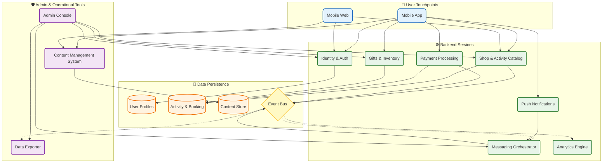

_Last updated: {{UPDATED_AT}}_

[<< Back to Index](../index.html) 

# ペットサービスEコマースエコシステム

## 概要
断片化したペットサービス業界をデジタル化するために設計された、包括的な**Online-to-Offline (O2O)**プラットフォーム。このエコシステムは、シームレスなモバイル体験を通じてペットオーナーとサービス提供者（グルーミング、預かり、トレーニング）をつなぐと同時に、堅牢な運用ツールでビジネスを支援します。

コンテンツ、コミュニティ、コマースを一元化することで、摩擦の多い手作業のアナログなやり取りを合理化されたデジタルワークフローへと変革し、発見や予約から決済、サービス後のエンゲージメントに至るライフサイクル全体をカバーします。

## アーキテクチャ

### コンポーネントの役割
- **Mobile App (iOS/Android):** コンテンツの閲覧、サービスの予約、参加登録、安全な決済を行うための主要なチャネル。
- **Mobile Web:** 発見、ソーシャルシェア、ユーザー獲得に焦点を当てた軽量なSEO最適化バージョン。
- **Content Management System (CMS):** ペットの健康、グルーミング、イベントに関するリッチメディア記事を作成・公開し、エンゲージメントを促進。
- **Admin Console:** 運用スタッフがユーザー、ショップ、UGCモデレーション、システム設定を管理するための中央コマンドセンター。
- **Identity & Auth:** 登録、SSO、ペットプロフィールを扱う一元化されたユーザー管理。
- **Shop & Activity Engine:** サービスリスト、スケジュール、リアルタイム空き枠在庫、予約ロジックをオーケストレーション。
- **Payment Gateway:** オンライン決済、返金、加盟店向けの自動精算レポートを安全に処理。
- **Push & Notification Service:** ライフサイクルマーケティング、トランザクション通知、ターゲットを絞ったエンゲージメントキャンペーンを管理。
- **Analytics & BI:** 運用データを集約し、維持率、コンバージョン、ユーザー行動に関する実用的なインサイトを提供。

## デジタルトランスフォーメーション (DX) ユースケース

### レガシープロセス（As-Is/現状）
当社は以前、年間数百件のオフラインイベントを手作業のワークフローで管理していました：
1.  **プロモーション:** ソーシャルメディアやSNSチャネルに分散。
2.  **登録:** インスタントメッセージや紙のフォームによる手動での参加者詳細収集。
3.  **現場オペレーション:** 物理的なチェックインリスト、現金のみの支払い、手動でのギフト引き換え。
4.  **精算:** 財務やフィードバックのために、イベント後に手間のかかるスプレッドシート更新作業。

### プラットフォームワークフロー（To-Be/あるべき姿）
プラットフォームは活動ライフサイクル全体をデジタル化します：
1.  **イベント前:** アプリ内バナーやプッシュ通知による自動プロモーション、即時のオンライン予約と決済。
    - *メリット:* 事務作業なしでコンバージョンとキャッシュフローが改善。
2.  **現場:** QRコードによる非接触チェックイン、デジタルチケットの検証、自動在庫同期。
    - *メリット:* 入場待ち行列の解消と、リアルタイムの参加者追跡。
3.  **イベント後:** デジタルアンケートの自動配信と、参加履歴に基づくターゲットを絞ったリマーケティング。
    - *メリット:* 顧客ロイヤルティの向上と、手作業によるデータ入力の排除。
